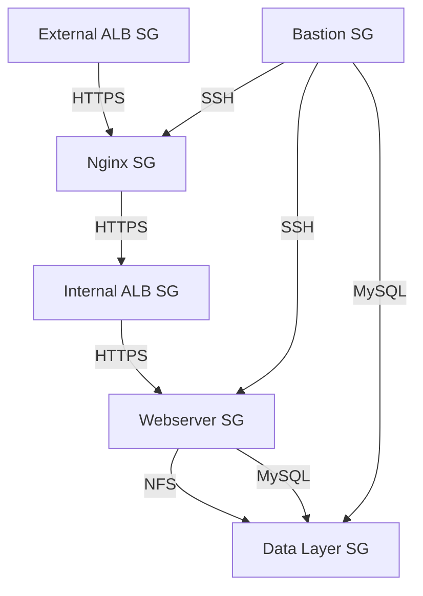

# Automate Infrastructure With IaC using Terraform-PART2

Welcome to the world of Infrastructure as Code (IaC) with Terraform! In this guide, we will walk you through the process of automating the creation of AWS resources using Terraform.

## Table of Contents
1. [Introduction](#introduction)
2. [Networking](#networking)
   - [Private Subnets & Best Practices](#private-subnets--best-practices)
   - [Tagging](#tagging)
   - [Internet Gateways & `format()` Function](#internet-gateways--format-function)
   - [NAT Gateways](#nat-gateways)
   - [AWS Routes](#aws-routes)
3. [AWS Identity and Access Management (IAM)](#aws-identity-and-access-management-iam)
   - [IAM Roles](#iam-roles)
   - [IAM Policies](#iam-policies)
   - [Instance Profiles](#instance-profiles)
4. [Security Groups](#security-groups)
5. [Certificates with AWS Certificate Manager](#certificates-with-aws-certificate-manager)
6. [Application Load Balancers (ALB)](#application-load-balancers-alb)
   - [External ALB](#external-alb)
   - [Internal ALB](#internal-alb)
7. [Auto Scaling Groups (ASG)](#auto-scaling-groups-asg)
   - [Launch Templates](#launch-templates)
   - [Auto Scaling Groups](#auto-scaling-groups)
8. [Storage and Database](#storage-and-database)
   - [Elastic File System (EFS)](#elastic-file-system-efs)
   - [Relational Database Service (RDS)](#relational-database-service-rds)
9. [Variables and Outputs](#variables-and-outputs)
10. [Conclusion](#conclusion)

## Introduction

Terraform is an open-source tool that allows you to define and provision infrastructure using a high-level configuration language. With Terraform, you can manage cloud resources such as virtual machines, networks, and databases in a declarative way.

In this guide, we will continue from where we left off in the previous project and create more AWS resources, including private subnets, NAT gateways, IAM roles, security groups, and more.

## Networking

### Vpc creation
⚠️ NOTE: All the files we will be creating should be in the same directory/folder.
Create a new file provider.tf and populate it with the following:

```hcl
provider "aws" {
  region = var.region
}
```


Create a new file vpc.tf, populate it with this content:
```hcl
# Get list of availability zones in the region
data "aws_availability_zones" "available" {
    state          = "available"
}

resource "aws_vpc" "main" {
  cidr_block = var.vpc_cidr
  enable_dns_support = true
  enable_dns_hostnames = true

  tags = merge(
    var.tags,
    {
      Name = "Production-VPC"
    }
  )

}
```


### Private Subnets & Best Practices

In AWS, subnets are subdivisions of a VPC (Virtual Private Cloud) that allow you to isolate resources. Private subnets are typically used for resources that should not be directly accessible from the internet.

#### Creating Private Subnets

Let's create 4 private subnets following these principles:

We are going to be utilizing;

Dynamic AZ Utilization
```hcl
# Use variables or length() function for AZ count
count = length(data.aws_availability_zones.available.names)
```

Automated CIDR Allocation
```hcl
# Use cidrsubnet() function for subnet ranges
cidr_block = cidrsubnet(var.vpc_cidr, 4, count.index)
```

To create private subnets, we will use the `aws_subnet` resource. We will also use variables and the `cidrsubnet()` function to allocate IP addresses dynamically. Create a new file subnets.tf. This a sample of my terraform code for creating 4 private subnet and 2 public subnets:

```hcl
# Dynamically Create Private Subnets
resource "aws_subnet" private {
    count = var.preferred_number_of_private_subnets == null? length(data.aws_availability_zones.available.names) : var.preferred_number_of_private_subnets
    vpc_id = aws_vpc.main.id
    cidr_block = cidrsubnet(var.vpc_cidr, 4, count.index)
    availability_zone = data.aws_availability_zones.available.names[count.index % length(data.aws_availability_zones.available.names)]
    map_public_ip_on_launch = false
    
    tags = merge(
        var.tags,
        {
            Name = format("Private-Subnet-%s", count.index + 1)
            
        }
    )
}

# Dynamically Create Public Subnets
resource "aws_subnet" public {
    count = var.preferred_number_of_public_subnets == null ? length(data.aws_availability_zones.available.names) : var.preferred_number_of_public_subnets
    vpc_id = aws_vpc.main.id
    cidr_block = cidrsubnet(var.vpc_cidr, 4, count.index + 4) # We added `+4` to the index to avoid overlapping with the private subnets CIDR blocks 
    map_public_ip_on_launch = true
    availability_zone = data.aws_availability_zones.available.names[count.index]

    tags = merge(
        var.tags,
        {
            Name = format("Public-Subnet-%s", count.index + 1)
            
        }
    )
}

```


### **Line-by-Line Explanation for dynamically Creating Private Subnets**

1. **`resource "aws_subnet" "private" {`**  
   - Declares a Terraform resource of type `aws_subnet` named `private`. This will create private subnets in AWS.

2. **`count = var.preferred_number_of_private_subnets == null ? length(data.aws_availability_zones.available.names) : var.preferred_number_of_private_subnets`**  
   - **`count`**: Determines how many private subnets to create.
   - **Ternary Operator (`? :`)**:
     - If `var.preferred_number_of_private_subnets` is `null`, the number of subnets created will equal the number of available Availability Zones (AZs) in the region (`length(data.aws_availability_zones.available.names)`).
     - If `var.preferred_number_of_private_subnets` is not `null`, the specified number of subnets will be created.

3. **`vpc_id = aws_vpc.main.id`**  
   - Associates the subnet with the VPC created earlier (`aws_vpc.main`).

4. **`cidr_block = cidrsubnet(var.vpc_cidr, 4, count.index)`**  
   - **`cidrsubnet()`**: Dynamically calculates the CIDR block for each subnet.
     - **`var.vpc_cidr`**: The CIDR block of the VPC.
     - **`4`**: The number of additional bits to add to the VPC CIDR for subnetting.
     - **`count.index`**: The index of the subnet being created (used to ensure unique CIDR blocks).

5. **`availability_zone = data.aws_availability_zones.available.names[count.index % length(data.aws_availability_zones.available.names)]`**  
   - Assigns an Availability Zone (AZ) to each subnet.
   - **`data.aws_availability_zones.available.names`**: A list of available AZs in the region.
   - **`count.index % length(data.aws_availability_zones.available.names)`**: Ensures AZs are reused in a round-robin fashion if the number of subnets exceeds the number of AZs.

6. **`map_public_ip_on_launch = false`**  
   - Ensures that instances launched in this subnet do **not** automatically receive a public IP address (since this is a private subnet).

7. **`tags = merge(var.tags, { Name = format("Private-Subnet-%s", count.index + 1) })`**  
   - Adds tags to the subnet.
   - **`merge()`**: Combines the default tags (`var.tags`) with a resource-specific tag (`Name`).
   - **`format("Private-Subnet-%s", count.index + 1)`**: Dynamically generates a unique name for each subnet (e.g., `Private-Subnet-1`, `Private-Subnet-2`).


### **Line-by-Line Explanation for dynamically Creating Public Subnets**

1. **`resource "aws_subnet" "public" {`**  
   - Declares a Terraform resource of type `aws_subnet` named `public`. This will create public subnets in AWS.

2. **`count = var.preferred_number_of_public_subnets == null ? length(data.aws_availability_zones.available.names) : var.preferred_number_of_public_subnets`**  
   - **`count`**: Determines how many public subnets to create.
   - **Ternary Operator (`? :`)**:
     - If `var.preferred_number_of_public_subnets` is `null`, the number of subnets created will equal the number of available AZs in the region (`length(data.aws_availability_zones.available.names)`).
     - If `var.preferred_number_of_public_subnets` is not `null`, the specified number of subnets will be created.

3. **`vpc_id = aws_vpc.main.id`**  
   - Associates the subnet with the VPC created earlier (`aws_vpc.main`).

4. **`cidr_block = cidrsubnet(var.vpc_cidr, 4, count.index + 4)`**  
   - **`cidrsubnet()`**: Dynamically calculates the CIDR block for each subnet.
     - **`var.vpc_cidr`**: The CIDR block of the VPC.
     - **`4`**: The number of additional bits to add to the VPC CIDR for subnetting.
     - **`count.index + 4`**: Adds an offset of `4` to the index to avoid overlapping CIDR blocks with private subnets.

5. **`map_public_ip_on_launch = true`**  
   - Ensures that instances launched in this subnet **automatically receive a public IP address** (since this is a public subnet).

6. **`availability_zone = data.aws_availability_zones.available.names[count.index]`**  
   - Assigns an Availability Zone (AZ) to each subnet.
   - **`data.aws_availability_zones.available.names`**: A list of available AZs in the region.
   - **`count.index`**: Ensures each subnet is created in a unique AZ.

7. **`tags = merge(var.tags, { Name = format("Public-Subnet-%s", count.index + 1) })`**  
   - Adds tags to the subnet.
   - **`merge()`**: Combines the default tags (`var.tags`) with a resource-specific tag (`Name`).
   - **`format("Public-Subnet-%s", count.index + 1)`**: Dynamically generates a unique name for each subnet (e.g., `Public-Subnet-1`, `Public-Subnet-2`).

Now let's make sure to create a variables.tf file and let it have the below content:

```hcl
variable "region"{
    default = "eu-west-2"
}

variable "vpc_cidr"{
    default = "172.16.0.0/16"
}

variable "enable_dns_support"{
    default = "true"
}

variable "enable_dns_hostnames"{
    default = "true"
}

variable "preferred_number_of_private_subnets"{
    default = null
}

variable "tags"{
    description = "Tags to be applied to the resources"
    type        = map(string)
    default = {
        Environment = "production"
        Owner       = "I.T. Admin"
        Terraform   = "true"
        Project     = "PBL"
    }
}
```

### **Variables Explained**

1. **`region`**  
   - Specifies the AWS region where resources will be deployed. By default, it is set to `"eu-west-2"` (London).

2. **`vpc_cidr`**  
   - Defines the CIDR block for the VPC (Virtual Private Cloud). The default value is `"172.16.0.0/16"`, which provides a large IP address range for your VPC.

3. **`enable_dns_support`**  
   - Enables DNS support for the VPC. When set to `"true"`, instances in the VPC can use DNS for communication.

4. **`enable_dns_hostnames`**  
   - Enables DNS hostnames for the VPC. When set to `"true"`, instances in the VPC will automatically receive DNS hostnames.

5. **`preferred_number_of_private_subnets`**  
   - Specifies the number of private subnets to create. If set to `null`, the number of subnets will match the number of Availability Zones (AZs) in the region.

6. **`tags`**  
   - Defines a set of tags to be applied to all resources. Tags are key-value pairs that help organize and manage resources in AWS. The default tags include:  
     - `Environment = "production"`  
     - `Owner = "I.T. Admin"`  
     - `Terraform = "true"`  
     - `Project = "PBL"`

Then let us go ahead to create a terraform.tfvars file with contents like the below:
```hcl
region = "eu-west-2"
vpc_cidr = "172.16.0.0/16"
enable_dns_support = "true"
enable_dns_hostnames = "true"
preferred_number_of_private_subnets = 4
preferred_number_of_public_subnets = 2
tags = {
    Environment = "production"
    Owner       = "taiwo@adebiyi.com"
    Terraform   = "true"
    Project     = "PBL"
}
```

### **Variable Values Explained**

1. **`region`**  
   - The AWS region where resources will be deployed is set to `"eu-west-2"` (London).

2. **`vpc_cidr`**  
   - The CIDR block for the VPC is set to `"172.16.0.0/16"`, providing a large IP address range for the VPC.

3. **`enable_dns_support`**  
   - DNS support is enabled for the VPC, allowing instances to use DNS for communication.

4. **`enable_dns_hostnames`**  
   - DNS hostnames are enabled for the VPC, so instances will automatically receive DNS hostnames.

5. **`preferred_number_of_private_subnets`**  
   - The number of private subnets to create is set to `4`.

6. **`preferred_number_of_public_subnets`**  
   - The number of public subnets to create is set to `2`.

7. **`tags`**  
   - Tags are applied to all resources for better organization and management. The tags include:  
     - `Environment = "production"`  
     - `Owner = "taiwo@adebiyi.com"`  
     - `Terraform = "true"`  
     - `Project = "PBL"`

Now let's run terraform apply and see what gets created from our aws console.


### Tagging

Tagging is a powerful concept in AWS that helps you organize and manage resources efficiently. Tags are key-value pairs that you can attach to resources.

#### Example of Tagging

```hcl
tags = merge(
  var.tags,
  {
    Name = "Name of the resource"
  },
)
```

- **merge()**: This function combines multiple maps of tags into a single map.
- **var.tags**: This is a variable that contains default tags.

### Internet Gateways & `format()` Function

An Internet Gateway (IGW) allows resources in a VPC to connect to the internet.

#### Creating an Internet Gateway
Create a new file internet_gateway.tf with below content:

```hcl
resource "aws_internet_gateway" "igw" {
    vpc_id = aws_vpc.main.id

    tags = merge(
        var.tags,
        {
            Name = format("%s-%s", aws_vpc.main.tags["Name"], "IGW")
        }
    )
}
```

### **Explanation of the above code**

1. **`resource "aws_internet_gateway" "igw" {`**  
   - Declares a Terraform resource of type `aws_internet_gateway` named `igw`. This will create an Internet Gateway in AWS.

2. **`vpc_id = aws_vpc.main.id`**  
   - Attaches the IGW to the VPC created earlier (`aws_vpc.main`). This links the IGW to the VPC, enabling internet access for resources within the VPC.

3. **`tags = merge(var.tags, { Name = format("%s-%s", aws_vpc.main.tags["Name"], "IGW") })`**  
   - Adds tags to the IGW for better organization and management.  
   - **`merge()`**: Combines the default tags (`var.tags`) with a resource-specific tag (`Name`).  
   - **`format()`**: Dynamically generates a unique name for the IGW by combining the VPC's name (from its tags) with the string `"IGW"`.

Terraform Plan and apply Showing IGW Creation


Internet Gateway Created in AWS Console


### NAT Gateways

A NAT Gateway allows instances in a private subnet to connect to the internet while preventing the internet from initiating connections with those instances.

#### Creating Elastic IP and NAT Gateway
Create a new file natgateway.tf:

```hcl
# Create Elastic IP for NAT Gateway
resource "aws_eip" "nat_eip" {
  domain = "vpc"
  depends_on = [aws_internet_gateway.igw]

  tags = merge(
    var.tags,
    {
      Name = format("%s-EIP", var.name)
    },
  )
}

# Create NAT Gateway
resource "aws_nat_gateway" "nat" {
  allocation_id = aws_eip.nat_eip.id
  subnet_id     = element(aws_subnet.public.*.id, 0)
  depends_on    = [aws_internet_gateway.igw]

  tags = merge(
    var.tags,
    {
      Name = format("%s-Nat", var.name)
    },
  )
}
```

### create an **Elastic IP (EIP)** and a **NAT Gateway** in AWS.

1. **Elastic IP (EIP)**  
   - **`domain = "vpc"`**: The EIP is created for use within the VPC.  
   - **`depends_on = [aws_internet_gateway.igw]`**: Ensures the Internet Gateway (IGW) is created before the EIP.  
   - **`tags`**: Tags are applied to the EIP for better organization and management. The `format()` function dynamically generates a unique name for the EIP using the `var.name` variable.

2. **NAT Gateway**  
   - **`allocation_id = aws_eip.nat_eip.id`**: Associates the NAT Gateway with the EIP created earlier.  
   - **`subnet_id = element(aws_subnet.public.*.id, 0)`**: Places the NAT Gateway in the first public subnet.  
   - **`depends_on = [aws_internet_gateway.igw]`**: Ensures the Internet Gateway (IGW) is created before the NAT Gateway.  
   - **`tags`**: Tags are applied to the NAT Gateway for better organization and management. The `format()` function dynamically generates a unique name for the NAT Gateway using the `var.name` variable.

NAT Gateway and EIP Configuration in Terraform


Elastic IP Created in AWS Console


NAT Gateway Created in AWS Console


### AWS Routes

Routes define how traffic is directed within a VPC. We will create route tables for both public and private subnets.

#### Creating Route Tables
Let's create route tables for both public and private subnets. Create a new file route_tables.tf:

```hcl
# Create Private Route Table
resource "aws_route_table" "private-rtb" {
  vpc_id = aws_vpc.main.id

  route {
    cidr_block = "0.0.0.0/0"
    nat_gateway_id = aws_nat_gateway.nat.id
  }
  tags = merge(
    var.tags,
    {
      Name = format("%s-Private-Route-Table", var.tags["Environment"])
    }
  )
}

# Private Subnet Associations
resource "aws_route_table_association" "private-subnets-assoc" {
  count          = length(aws_subnet.private[*].id)
  subnet_id      = element(aws_subnet.private[*].id, count.index)
  route_table_id = aws_route_table.private-rtb.id
}

# Public Route Table
resource "aws_route_table" "public-rtb" {
  vpc_id = aws_vpc.main.id

  tags = merge(
    var.tags,
    {
      Name = format("%s-Public-Route-Table", var.name)
    },
  )
}

# Public Route
resource "aws_route" "public-rtb-route" {
  route_table_id         = aws_route_table.public-rtb.id
  destination_cidr_block = "0.0.0.0/0"
  gateway_id             = aws_internet_gateway.igw.id
}

# Public Subnet Associations
resource "aws_route_table_association" "public-subnets-assoc" {
  count          = length(aws_subnet.public[*].id)
  subnet_id      = element(aws_subnet.public[*].id, count.index)
  route_table_id = aws_route_table.public-rtb.id
}
```


This section explains the Terraform code used to create **private** and **public route tables** and associate them with subnets.

---

### **1. Private Route Table**

- **`vpc_id`**: Associates the route table with the VPC.  
- **`route`**: Adds a route to the route table.  
  - **`cidr_block = "0.0.0.0/0"`**: Routes all traffic (0.0.0.0/0) to the NAT Gateway.  
  - **`nat_gateway_id`**: Specifies the NAT Gateway for the route.  
- **`tags`**: Adds tags to the route table.  
  - **`format()`**: Dynamically generates a name for the route table using the `Environment` tag.

---

### **2. Private Subnet Associations**

- **`count`**: Creates an association for each private subnet.  
- **`subnet_id`**: Associates each private subnet with the private route table.  
- **`route_table_id`**: Specifies the private route table to associate with.

---

### **3. Public Route Table**

- **`vpc_id`**: Associates the route table with the VPC.  
- **`tags`**: Adds tags to the route table.  
  - **`format()`**: Dynamically generates a name for the route table using `var.name`.

---

### **4. Public Route**

- **`route_table_id`**: Specifies the public route table.  
- **`destination_cidr_block = "0.0.0.0/0"`**: Routes all traffic (0.0.0.0/0) to the Internet Gateway.  
- **`gateway_id`**: Specifies the Internet Gateway for the route.

---

### **5. Public Subnet Associations**

- **`count`**: Creates an association for each public subnet.  
- **`subnet_id`**: Associates each public subnet with the public route table.  
- **`route_table_id`**: Specifies the public route table to associate with.

Route Tables Configuration in Terraform


Route Tables Created in AWS Console


### Public Route Table Details


### Private Route Table Details


## AWS Identity and Access Management (IAM)

IAM allows you to manage access to AWS services and resources securely.

### IAM Roles

An IAM role is an identity that you can assume to gain temporary access to AWS resources.

#### Creating an IAM Role
Create a new file roles-and-policy.tf:

```hcl
resource "aws_iam_role" "ec2_instance_role" {
  name = "ec2_instance_role"
  assume_role_policy = jsonencode({
    Version = "2012-10-17"
    Statement = [
      {
        Action = "sts:AssumeRole"
        Effect = "Allow"
        Sid    = ""
        Principal = {
          Service = "ec2.amazonaws.com"
        }
      },
    ]
  })

  tags = merge(
    var.tags,
    {
      Name = "aws assume role"
    },
  )
}
```
Explaining the Terraform code used to create an **IAM Role** in AWS.


1. **`resource "aws_iam_role" "ec2_instance_role" {`**  
   - Declares a Terraform resource of type `aws_iam_role` named `ec2_instance_role`. This will create an IAM Role in AWS.

2. **`name = "ec2_instance_role"`**  
   - Specifies the name of the IAM Role as `ec2_instance_role`.

3. **`assume_role_policy = jsonencode({ ... })`**  
   - Defines the trust policy for the IAM Role using JSON.  
   - **`jsonencode()`**: Converts the policy into JSON format.

4. **`Version = "2012-10-17"`**  
   - Specifies the version of the policy language.

5. **`Statement = [ ... ]`**  
   - Defines the permissions for the IAM Role.  
   - **`Action = "sts:AssumeRole"`**: Allows the `ec2.amazonaws.com` service to assume this role.  
   - **`Effect = "Allow"`**: Grants permission to assume the role.  
   - **`Principal = { Service = "ec2.amazonaws.com" }`**: Specifies that EC2 instances can assume this role.

6. **`tags = merge(var.tags, { Name = "aws assume role" })`**  
   - Adds tags to the IAM Role for better organization and management.  
   - **`merge()`**: Combines the default tags (`var.tags`) with a resource-specific tag (`Name`).  
   - **`Name = "aws assume role"`**: Assigns a name tag to the role.


### IAM Policies

IAM policies define permissions for actions that can be performed on AWS resources.

#### Creating an IAM Policy Inside the same file

```hcl
# Create a resource role
resource  "aws_iam_role" "ec2_instance_role"{
    name = "ec2_instance_role"
    assume_role_policy = jsonencode({
        Version = "2012-10-17"
        Statement = [
            {
                Action      = "sts:AssumeRole"
                Effect      = "Allow"
                Sid         = ""
                Principal   = {
                    Service = "ec2.amazonaws.com"
                }
            }
        ]
    })

    tags = merge(
        var.tags,
        {
            Name = "aws assume role"
        }
    )
}

# Create an IAM Policy
resource "aws_iam_policy" "ec2_policy" {
    name                    = "ec2_instance_policy"
    description             = "This is a policy to grant access to all ec2 resource(s)" 
    policy                  = jsonencode({
        Version             = "2012-10-17"
        Statement           =[
            {
                Action      = [
                    "ec2:Describe*"
                ]
                Effect      = "Allow"
                Resource    = "*"
            }
        ]
    })

    tags = merge(
        var.tags,
        {
            Name    = "aws assume policy"
        }
    )
}

# Create KMS decrypt policy
resource "aws_iam_role_policy" "efs_kms_decrypt" {
    name = "AllowEFSToDecryptKMSKey"
    role = aws_iam_role.ec2_instance_role.name
    
    policy = jsonencode({
        Version          = "2012-10-17"
        Statement        = [
            {
                Action   = "kms:Decrypt"
                Effect   = "Allow"
                Resource = aws_kms_key.project-kms.arn
            }
        ]
    })
}
```
Explaining the Terraform code used to create **IAM Policies** in AWS.

### **1. Create an IAM Policy for EC2**

1. **`resource "aws_iam_policy" "ec2_policy" {`**  
   - Declares a Terraform resource of type `aws_iam_policy` named `ec2_policy`. This will create an IAM Policy in AWS.

2. **`name = "ec2_instance_policy"`**  
   - Specifies the name of the IAM Policy as `ec2_instance_policy`.

3. **`description = "This is a policy to grant access to all ec2 resource(s)"`**  
   - Provides a description of the policy.

4. **`policy = jsonencode({ ... })`**  
   - Defines the permissions for the IAM Policy using JSON.  
   - **`jsonencode()`**: Converts the policy into JSON format.

5. **`Version = "2012-10-17"`**  
   - Specifies the version of the policy language.

6. **`Statement = [ ... ]`**  
   - Defines the permissions for the IAM Policy.  
   - **`Action = ["ec2:Describe*"]`**: Allows the `Describe*` action on all EC2 resources.  
   - **`Effect = "Allow"`**: Grants permission for the action.  
   - **`Resource = "*"`**: Applies the permission to all EC2 resources.

7. **`tags = merge(var.tags, { Name = "aws assume policy" })`**  
   - Adds tags to the IAM Policy for better organization and management.  
   - **`merge()`**: Combines the default tags (`var.tags`) with a resource-specific tag (`Name`).  
   - **`Name = "aws assume policy"`**: Assigns a name tag to the policy.

### **2. Create a KMS Decrypt Policy**

1. **`resource "aws_iam_role_policy" "efs_kms_decrypt" {`**  
   - Declares a Terraform resource of type `aws_iam_role_policy` named `efs_kms_decrypt`. This will attach a policy to an IAM Role.

2. **`name = "AllowEFSToDecryptKMSKey"`**  
   - Specifies the name of the policy as `AllowEFSToDecryptKMSKey`.

3. **`role = aws_iam_role.ec2_instance_role.name`**  
   - Attaches the policy to the IAM Role (`ec2_instance_role`).

4. **`policy = jsonencode({ ... })`**  
   - Defines the permissions for the policy using JSON.  
   - **`jsonencode()`**: Converts the policy into JSON format.

5. **`Version = "2012-10-17"`**  
   - Specifies the version of the policy language.

6. **`Statement = [ ... ]`**  
   - Defines the permissions for the policy.  
   - **`Action = "kms:Decrypt"`**: Allows the `Decrypt` action on the specified KMS key.  
   - **`Effect = "Allow"`**: Grants permission for the action.  
   - **`Resource = aws_kms_key.project-kms.arn`**: Specifies the KMS key that can be decrypted.


### Attaching Policy to Role in the same File
```hcl
resource "aws_iam_role_policy_attachment" "test-attach" {
  role       = aws_iam_role.ec2_instance_role.name
  policy_arn = aws_iam_policy.ec2_policy.arn
}
```
Explaining the Terraform code used to attach an **IAM Policy** to an **IAM Role**.

1. **`resource "aws_iam_role_policy_attachment" "test-attach" {`**  
   - Declares a Terraform resource of type `aws_iam_role_policy_attachment` named `test-attach`. This will attach an IAM Policy to an IAM Role.

2. **`role = aws_iam_role.ec2_instance_role.name`**  
   - Specifies the IAM Role to which the policy will be attached.  
   - References the role named `ec2_instance_role`.

3. **`policy_arn = aws_iam_policy.ec2_policy.arn`**  
   - Specifies the ARN (Amazon Resource Name) of the IAM Policy to attach.  
   - References the policy named `policy`.


### Instance Profiles

An instance profile is a container for an IAM role that you can use to pass role information to an EC2 instance.

#### Creating an Instance Profile

```hcl
resource "aws_iam_instance_profile" "ip" {
  name = "aws_instance_profile_test"
  role = aws_iam_role.ec2_instance_role.name
}
```


IAM Roles and Policies in the Code Phase after tf-plan and tf-apply


If you encounter and Error "aws_kms_key.project-kms Not Declared"
Solution:
Declare the aws_kms_key resource in your variables.tf configuration. For example:

```hcl
Copy
resource "aws_kms_key" "project-kms" {
  description = "KMS key for project"
  tags = merge(
    var.tags,
    {
      Name = "project-kms-key"
    },
  )
}
```


### IAM Best Practices
Principle of Least Privilege

Grant minimum permissions needed
Regularly review and revoke unused permissions
Use specific resource ARNs when possible
Role Usage

Use roles instead of access keys
Rotate credentials regularly
Never hardcode credentials

Security Considerations
```hcl
# Example of restricted policy
{
  "Version": "2012-10-17",
  "Statement": [
    {
      "Effect": "Allow",
      "Action": ["s3:GetObject"],
      "Resource": ["arn:aws:s3:::my-bucket/*"],
      "Condition": {
        "StringEquals": {"aws:PrincipalTag/Environment": "Production"}
      }
    }
  ]
}
```
## Security Groups

Security groups act as virtual firewalls for your instances to control inbound and outbound traffic.

#### Creating Security Groups
Create a new file security.tf:

#### External Load Balancer Security Group
```hcl
# Security group for external ALB
resource "aws_security_group" "ext-alb-sg" {
  name        = "ext-alb-sg"
  vpc_id      = aws_vpc.main.id
  description = "Allow HTTP/HTTPS inbound traffic"

  ingress {
    description = "Allow HTTP connections"
    from_port   = 80
    to_port     = 80
    protocol    = "tcp"
    cidr_blocks = ["0.0.0.0/0"]
  }

  ingress {
    description = "Allow SSH connections"
    from_port   = 22
    to_port     = 22
    protocol    = "tcp"
    cidr_blocks = ["0.0.0.0/0"]
  }

  egress {
    description = "Allow all traffic"
    from_port   = 0
    to_port     = 0
    protocol    = "-1"
    cidr_blocks = ["0.0.0.0/0"]
  }

  tags = merge(
    var.tags,
    {
      Name = "ext-alb-sg"
    },
  )
}
```

Explaining the Terraform code used to create a **KMS Key** for encryption and a **Security Group** for an external Application Load Balancer (ALB).
#### **2. Create Security Group for External ALB**

1. **`resource "aws_security_group" "ext-alb-sg" {`**  
   - Declares a Terraform resource of type `aws_security_group` named `ext-alb-sg`. This will create a security group in AWS.

2. **`name = "ext-alb-sg"`**  
   - Specifies the name of the security group.

3. **`vpc_id = aws_vpc.main.id`**  
   - Associates the security group with the VPC.

4. **`description = "Allow HTTP/HTTPS inbound traffic"`**  
   - Provides a description for the security group.

5. **`ingress { ... }`**  
   - Defines inbound rules for the security group.  
   - **`description = "Allow HTTP connections"`**: Allows HTTP traffic on port 80.  
   - **`description = "Allow SSH connections"`**: Allows SSH traffic on port 22.  
   - **`cidr_blocks = ["0.0.0.0/0"]`**: Allows traffic from any IP address.

6. **`egress { ... }`**  
   - Defines outbound rules for the security group.  
   - **`description = "Allow all traffic"`**: Allows all outbound traffic.  
   - **`protocol = "-1"`**: Applies to all protocols.  
   - **`cidr_blocks = ["0.0.0.0/0"]`**: Allows traffic to any IP address.

7. **`tags = merge(var.tags, { Name = "ext-alb-sg" })`**  
   - Adds tags to the security group.  
   - **`merge()`**: Combines the default tags (`var.tags`) with a resource-specific tag (`Name`).  
   - **`Name = "ext-alb-sg"`**: Assigns a name tag to the security group.


#### Bastion Host Security Group
```hcl
resource "aws_security_group" "bastion_sg" {
  name        = "bastion_sg"
  vpc_id      = aws_vpc.main.id
  description = "Security group for bastion host SSH access"

  ingress {
    description = "SSH"
    from_port   = 22
    to_port     = 22
    protocol    = "tcp"
    cidr_blocks = ["0.0.0.0/0"]
  }

  egress {
    from_port   = 0
    to_port     = 0
    protocol    = "-1"
    cidr_blocks = ["0.0.0.0/0"]
  }

  tags = merge(
    var.tags,
    {
      Name = "Bastion-SG"
    },
  )
}
```

Explaining the Terraform code used to create a **Security Group** for a Bastion Host.

1. **`resource "aws_security_group" "bastion_sg" {`**  
   - Declares a Terraform resource of type `aws_security_group` named `bastion_sg`. This will create a security group in AWS.

2. **`name = "bastion_sg"`**  
   - Specifies the name of the security group.

3. **`vpc_id = aws_vpc.main.id`**  
   - Associates the security group with the VPC.

4. **`description = "Security group for bastion host SSH access"`**  
   - Provides a description for the security group.

5. **`ingress { ... }`**  
   - Defines inbound rules for the security group.  
   - **`description = "SSH"`**: Allows SSH traffic on port 22.  
   - **`cidr_blocks = ["0.0.0.0/0"]`**: Allows SSH access from any IP address.

6. **`egress { ... }`**  
   - Defines outbound rules for the security group.  
   - **`from_port = 0`**: Allows all outbound traffic.  
   - **`to_port = 0`**: Allows all outbound traffic.  
   - **`protocol = "-1"`**: Applies to all protocols.  
   - **`cidr_blocks = ["0.0.0.0/0"]`**: Allows traffic to any IP address.

7. **`tags = merge(var.tags, { Name = "Bastion-SG" })`**  
   - Adds tags to the security group.  
   - **`merge()`**: Combines the default tags (`var.tags`) with a resource-specific tag (`Name`).  
   - **`Name = "Bastion-SG"`**: Assigns a name tag to the security group.


#### Nginx Security Group
```hcl
resource "aws_security_group" "nginx-sg" {
  name   = "nginx-sg"
  vpc_id = aws_vpc.main.id

  egress {
    from_port   = 0
    to_port     = 0
    protocol    = "-1"
    cidr_blocks = ["0.0.0.0/0"]
  }

  tags = merge(
    var.tags,
    {
      Name = "nginx-SG"
    },
  )
}

# Nginx Security Group Rules
resource "aws_security_group_rule" "inbound-nginx-https" {
  type                     = "ingress"
  from_port                = 443
  to_port                  = 443
  protocol                 = "tcp"
  source_security_group_id = aws_security_group.ext-alb-sg.id
  security_group_id        = aws_security_group.nginx-sg.id
}

resource "aws_security_group_rule" "inbound-bastion-ssh" {
  type                     = "ingress"
  from_port                = 22
  to_port                  = 22
  protocol                 = "tcp"
  source_security_group_id = aws_security_group.bastion_sg.id
  security_group_id        = aws_security_group.nginx-sg.id
}
```
Explaining the Terraform code used to create a **Security Group** for Nginx and define its inbound rules.

#### **1. Create Nginx Security Group**

1. **`resource "aws_security_group" "nginx-sg" {`**  
   - Declares a Terraform resource of type `aws_security_group` named `nginx-sg`. This will create a security group in AWS.

2. **`name = "nginx-sg"`**  
   - Specifies the name of the security group.

3. **`vpc_id = aws_vpc.main.id`**  
   - Associates the security group with the VPC.

4. **`egress { ... }`**  
   - Defines outbound rules for the security group.  
   - **`from_port = 0`**: Allows all outbound traffic.  
   - **`to_port = 0`**: Allows all outbound traffic.  
   - **`protocol = "-1"`**: Applies to all protocols.  
   - **`cidr_blocks = ["0.0.0.0/0"]`**: Allows traffic to any IP address.

5. **`tags = merge(var.tags, { Name = "nginx-SG" })`**  
   - Adds tags to the security group.  
   - **`merge()`**: Combines the default tags (`var.tags`) with a resource-specific tag (`Name`).  
   - **`Name = "nginx-SG"`**: Assigns a name tag to the security group.

### **2. Nginx Security Group Rules**

1. **`resource "aws_security_group_rule" "inbound-nginx-https" {`**  
   - Declares a Terraform resource of type `aws_security_group_rule` named `inbound-nginx-https`. This will create an inbound rule for the Nginx security group.

2. **`type = "ingress"`**  
   - Specifies that this is an inbound rule.

3. **`from_port = 443`**  
   - Allows traffic on port 443 (HTTPS).

4. **`to_port = 443`**  
   - Allows traffic on port 443 (HTTPS).

5. **`protocol = "tcp"`**  
   - Specifies the TCP protocol.

6. **`source_security_group_id = aws_security_group.ext-alb-sg.id`**  
   - Allows traffic from the external ALB security group.

7. **`security_group_id = aws_security_group.nginx-sg.id`**  
   - Associates this rule with the Nginx security group.


#### **3. Bastion Host SSH Access Rule**

1. **`resource "aws_security_group_rule" "inbound-bastion-ssh" {`**  
   - Declares a Terraform resource of type `aws_security_group_rule` named `inbound-bastion-ssh`. This will create an inbound rule for SSH access.

2. **`type = "ingress"`**  
   - Specifies that this is an inbound rule.

3. **`from_port = 22`**  
   - Allows traffic on port 22 (SSH).

4. **`to_port = 22`**  
   - Allows traffic on port 22 (SSH).

5. **`protocol = "tcp"`**  
   - Specifies the TCP protocol.

6. **`source_security_group_id = aws_security_group.bastion_sg.id`**  
   - Allows traffic from the Bastion Host security group.

7. **`security_group_id = aws_security_group.nginx-sg.id`**  
   - Associates this rule with the Nginx security group.


#### Internal ALB Security Group
```hcl
resource "aws_security_group" "int-alb-sg" {
  name   = "int-alb-sg"
  vpc_id = aws_vpc.main.id

  egress {
    from_port   = 0
    to_port     = 0
    protocol    = "-1"
    cidr_blocks = ["0.0.0.0/0"]
  }

  tags = merge(
    var.tags,
    {
      Name = "int-alb-sg"
    },
  )
}

resource "aws_security_group_rule" "inbound-ialb-https" {
  type                     = "ingress"
  from_port                = 443
  to_port                  = 443
  protocol                 = "tcp"
  source_security_group_id = aws_security_group.nginx-sg.id
  security_group_id        = aws_security_group.int-alb-sg.id
}
```
Explaining the Terraform code used to create a **Security Group** for an Internal ALB and define its inbound rules.

#### **1. Create Internal ALB Security Group**

1. **`resource "aws_security_group" "int-alb-sg" {`**  
   - Declares a Terraform resource of type `aws_security_group` named `int-alb-sg`. This will create a security group in AWS.

2. **`name = "int-alb-sg"`**  
   - Specifies the name of the security group.

3. **`vpc_id = aws_vpc.main.id`**  
   - Associates the security group with the VPC.

4. **`egress { ... }`**  
   - Defines outbound rules for the security group.  
   - **`from_port = 0`**: Allows all outbound traffic.  
   - **`to_port = 0`**: Allows all outbound traffic.  
   - **`protocol = "-1"`**: Applies to all protocols.  
   - **`cidr_blocks = ["0.0.0.0/0"]`**: Allows traffic to any IP address.

5. **`tags = merge(var.tags, { Name = "int-alb-sg" })`**  
   - Adds tags to the security group.  
   - **`merge()`**: Combines the default tags (`var.tags`) with a resource-specific tag (`Name`).  
   - **`Name = "int-alb-sg"`**: Assigns a name tag to the security group.

#### **2. Internal ALB Security Group Rule**

1. **`resource "aws_security_group_rule" "inbound-ialb-https" {`**  
   - Declares a Terraform resource of type `aws_security_group_rule` named `inbound-ialb-https`. This will create an inbound rule for the Internal ALB security group.

2. **`type = "ingress"`**  
   - Specifies that this is an inbound rule.

3. **`from_port = 443`**  
   - Allows traffic on port 443 (HTTPS).

4. **`to_port = 443`**  
   - Allows traffic on port 443 (HTTPS).

5. **`protocol = "tcp"`**  
   - Specifies the TCP protocol.

6. **`source_security_group_id = aws_security_group.nginx-sg.id`**  
   - Allows traffic from the Nginx security group.

7. **`security_group_id = aws_security_group.int-alb-sg.id`**  
   - Associates this rule with the Internal ALB security group.


#### Webserver Security Group
```hcl
resource "aws_security_group" "webserver-sg" {
  name   = "webserver-sg"
  vpc_id = aws_vpc.main.id

  egress {
    from_port   = 0
    to_port     = 0
    protocol    = "-1"
    cidr_blocks = ["0.0.0.0/0"]
  }

  tags = merge(
    var.tags,
    {
      Name = "webserver-sg"
    },
  )
}

# Webserver Security Group Rules
resource "aws_security_group_rule" "inbound-web-https" {
  type                     = "ingress"
  from_port                = 443
  to_port                  = 443
  protocol                 = "tcp"
  source_security_group_id = aws_security_group.int-alb-sg.id
  security_group_id        = aws_security_group.webserver-sg.id
}

resource "aws_security_group_rule" "inbound-web-ssh" {
  type                     = "ingress"
  from_port                = 22
  to_port                  = 22
  protocol                 = "tcp"
  source_security_group_id = aws_security_group.bastion_sg.id
  security_group_id        = aws_security_group.webserver-sg.id
}
```
This section explains the Terraform code used to create a **Security Group** for a Web Server and define its inbound rules.

#### **1. Create Web Server Security Group**

1. **`resource "aws_security_group" "webserver-sg" {`**  
   - Declares a Terraform resource of type `aws_security_group` named `webserver-sg`. This will create a security group in AWS.

2. **`name = "webserver-sg"`**  
   - Specifies the name of the security group.

3. **`vpc_id = aws_vpc.main.id`**  
   - Associates the security group with the VPC.

4. **`egress { ... }`**  
   - Defines outbound rules for the security group.  
   - **`from_port = 0`**: Allows all outbound traffic.  
   - **`to_port = 0`**: Allows all outbound traffic.  
   - **`protocol = "-1"`**: Applies to all protocols.  
   - **`cidr_blocks = ["0.0.0.0/0"]`**: Allows traffic to any IP address.

5. **`tags = merge(var.tags, { Name = "webserver-sg" })`**  
   - Adds tags to the security group.  
   - **`merge()`**: Combines the default tags (`var.tags`) with a resource-specific tag (`Name`).  
   - **`Name = "webserver-sg"`**: Assigns a name tag to the security group.

#### **2. Web Server Security Group Rules**

1. **`resource "aws_security_group_rule" "inbound-web-https" {`**  
   - Declares a Terraform resource of type `aws_security_group_rule` named `inbound-web-https`. This will create an inbound rule for HTTPS traffic.

2. **`type = "ingress"`**  
   - Specifies that this is an inbound rule.

3. **`from_port = 443`**  
   - Allows traffic on port 443 (HTTPS).

4. **`to_port = 443`**  
   - Allows traffic on port 443 (HTTPS).

5. **`protocol = "tcp"`**  
   - Specifies the TCP protocol.

6. **`source_security_group_id = aws_security_group.int-alb-sg.id`**  
   - Allows traffic from the Internal ALB security group.

7. **`security_group_id = aws_security_group.webserver-sg.id`**  
   - Associates this rule with the Web Server security group.

#### **3. Bastion Host SSH Access Rule**

1. **`resource "aws_security_group_rule" "inbound-web-ssh" {`**  
   - Declares a Terraform resource of type `aws_security_group_rule` named `inbound-web-ssh`. This will create an inbound rule for SSH access.

2. **`type = "ingress"`**  
   - Specifies that this is an inbound rule.

3. **`from_port = 22`**  
   - Allows traffic on port 22 (SSH).

4. **`to_port = 22`**  
   - Allows traffic on port 22 (SSH).

5. **`protocol = "tcp"`**  
   - Specifies the TCP protocol.

6. **`source_security_group_id = aws_security_group.bastion_sg.id`**  
   - Allows traffic from the Bastion Host security group.

7. **`security_group_id = aws_security_group.webserver-sg.id`**  
   - Associates this rule with the Web Server security group.


#### Data Layer Security Group
```hcl
resource "aws_security_group" "datalayer-sg" {
  name   = "datalayer-sg"
  vpc_id = aws_vpc.main.id

  egress {
    from_port   = 0
    to_port     = 0
    protocol    = "-1"
    cidr_blocks = ["0.0.0.0/0"]
  }

  tags = merge(
    var.tags,
    {
      Name = "datalayer-sg"
    },
  )
}

# Data Layer Security Group Rules
resource "aws_security_group_rule" "inbound-nfs-port" {
  type                     = "ingress"
  from_port                = 2049
  to_port                  = 2049
  protocol                 = "tcp"
  source_security_group_id = aws_security_group.webserver-sg.id
  security_group_id        = aws_security_group.datalayer-sg.id
}

resource "aws_security_group_rule" "inbound-mysql-bastion" {
  type                     = "ingress"
  from_port                = 3306
  to_port                  = 3306
  protocol                 = "tcp"
  source_security_group_id = aws_security_group.bastion_sg.id
  security_group_id        = aws_security_group.datalayer-sg.id
}

resource "aws_security_group_rule" "inbound-mysql-webserver" {
  type                     = "ingress"
  from_port                = 3306
  to_port                  = 3306
  protocol                 = "tcp"
  source_security_group_id = aws_security_group.webserver-sg.id
  security_group_id        = aws_security_group.datalayer-sg.id
}
```
This section explains the Terraform code used to create a **Security Group** for the Data Layer and define its inbound rules.

### **1. Create Data Layer Security Group**

1. **`resource "aws_security_group" "datalayer-sg" {`**  
   - Declares a Terraform resource of type `aws_security_group` named `datalayer-sg`. This will create a security group in AWS.

2. **`name = "datalayer-sg"`**  
   - Specifies the name of the security group.

3. **`vpc_id = aws_vpc.main.id`**  
   - Associates the security group with the VPC.

4. **`egress { ... }`**  
   - Defines outbound rules for the security group.  
   - **`from_port = 0`**: Allows all outbound traffic.  
   - **`to_port = 0`**: Allows all outbound traffic.  
   - **`protocol = "-1"`**: Applies to all protocols.  
   - **`cidr_blocks = ["0.0.0.0/0"]`**: Allows traffic to any IP address.

5. **`tags = merge(var.tags, { Name = "datalayer-sg" })`**  
   - Adds tags to the security group.  
   - **`merge()`**: Combines the default tags (`var.tags`) with a resource-specific tag (`Name`).  
   - **`Name = "datalayer-sg"`**: Assigns a name tag to the security group.

### **2. Data Layer Security Group Rules**

1. **`resource "aws_security_group_rule" "inbound-nfs-port" {`**  
   - Declares a Terraform resource of type `aws_security_group_rule` named `inbound-nfs-port`. This will create an inbound rule for NFS traffic.

2. **`type = "ingress"`**  
   - Specifies that this is an inbound rule.

3. **`from_port = 2049`**  
   - Allows traffic on port 2049 (NFS).

4. **`to_port = 2049`**  
   - Allows traffic on port 2049 (NFS).

5. **`protocol = "tcp"`**  
   - Specifies the TCP protocol.

6. **`source_security_group_id = aws_security_group.webserver-sg.id`**  
   - Allows traffic from the Web Server security group.

7. **`security_group_id = aws_security_group.datalayer-sg.id`**  
   - Associates this rule with the Data Layer security group.

### **3. Bastion Host MySQL Access Rule**

1. **`resource "aws_security_group_rule" "inbound-mysql-bastion" {`**  
   - Declares a Terraform resource of type `aws_security_group_rule` named `inbound-mysql-bastion`. This will create an inbound rule for MySQL traffic from the Bastion Host.

2. **`type = "ingress"`**  
   - Specifies that this is an inbound rule.

3. **`from_port = 3306`**  
   - Allows traffic on port 3306 (MySQL).

4. **`to_port = 3306`**  
   - Allows traffic on port 3306 (MySQL).

5. **`protocol = "tcp"`**  
   - Specifies the TCP protocol.

6. **`source_security_group_id = aws_security_group.bastion_sg.id`**  
   - Allows traffic from the Bastion Host security group.

7. **`security_group_id = aws_security_group.datalayer-sg.id`**  
   - Associates this rule with the Data Layer security group.

### **4. Web Server MySQL Access Rule**

1. **`resource "aws_security_group_rule" "inbound-mysql-webserver" {`**  
   - Declares a Terraform resource of type `aws_security_group_rule` named `inbound-mysql-webserver`. This will create an inbound rule for MySQL traffic from the Web Server.

2. **`type = "ingress"`**  
   - Specifies that this is an inbound rule.

3. **`from_port = 3306`**  
   - Allows traffic on port 3306 (MySQL).

4. **`to_port = 3306`**  
   - Allows traffic on port 3306 (MySQL).

5. **`protocol = "tcp"`**  
   - Specifies the TCP protocol.

6. **`source_security_group_id = aws_security_group.webserver-sg.id`**  
   - Allows traffic from the Web Server security group.

7. **`security_group_id = aws_security_group.datalayer-sg.id`**  
   - Associates this rule with the Data Layer security group.


#### Security Group Relationships




## Target Groups and Load Balancer Configuration

### Target Groups Setup
Target Groups are used to route requests to registered targets (EC2 instances). We will now create three target groups for our infrastructure:

Nginx Target Group
WordPress Target Group
Tooling Target Group
Create a new file target-groups.tf:

```hcl
# Nginx Target Group
resource "aws_lb_target_group" "nginx-tgt" {
  name        = "nginx-tgt"
  port        = 80
  protocol    = "HTTP"
  vpc_id      = aws_vpc.main.id
  target_type = "instance"
  
  health_check {
    interval            = 10
    path               = "/healthz"
    healthy_threshold   = 2
    unhealthy_threshold = 2
    timeout             = 5
  }

  tags = merge(
    var.tags,
    {
      Name = "nginx-tgt"
    },
  )
}

# WordPress Target Group
resource "aws_lb_target_group" "wordpress-tgt" {
  name        = "wordpress-tgt"
  port        = 80
  protocol    = "HTTP"
  vpc_id      = aws_vpc.main.id
  target_type = "instance"
  
  health_check {
    interval            = 10
    path               = "/healthz"
    healthy_threshold   = 2
    unhealthy_threshold = 2
    timeout             = 5
  }

  tags = merge(
    var.tags,
    {
      Name = "wordpress-tgt"
    },
  )
}

# Tooling Target Group
resource "aws_lb_target_group" "tooling-tgt" {
  name        = "tooling-tgt"
  port        = 80
  protocol    = "HTTP"
  vpc_id      = aws_vpc.main.id
  target_type = "instance"
  
  health_check {
    interval            = 10
    path               = "/healthz"
    healthy_threshold   = 2
    unhealthy_threshold = 2
    timeout             = 5
  }

  tags = merge(
    var.tags,
    {
      Name = "tooling-tgt"
    },
  )
}
```
Explaining the Terraform code used to create **Target Groups** for Nginx, WordPress, and Tooling.

#### **1. Nginx Target Group**

1. **`resource "aws_lb_target_group" "nginx-tgt" {`**  
   - Declares a Terraform resource of type `aws_lb_target_group` named `nginx-tgt`. This will create a target group for Nginx.

2. **`name = "nginx-tgt"`**  
   - Specifies the name of the target group.

3. **`port = 80`**  
   - Listens on port 80 (HTTP).

4. **`protocol = "HTTP"`**  
   - Uses the HTTP protocol.

5. **`vpc_id = aws_vpc.main.id`**  
   - Associates the target group with the VPC.

6. **`target_type = "instance"`**  
   - Routes traffic to EC2 instances.

7. **`health_check { ... }`**  
   - Configures health checks for the target group.  
   - **`interval = 10`**: Checks every 10 seconds.  
   - **`path = "/healthz"`**: Uses `/healthz` for health checks.  
   - **`healthy_threshold = 2`**: Requires 2 successful checks to mark as healthy.  
   - **`unhealthy_threshold = 2`**: Requires 2 failed checks to mark as unhealthy.  
   - **`timeout = 5`**: Sets the health check timeout to 5 seconds.

8. **`tags = merge(var.tags, { Name = "nginx-tgt" })`**  
   - Adds tags to the target group.  
   - **`merge()`**: Combines the default tags (`var.tags`) with a resource-specific tag (`Name`).  
   - **`Name = "nginx-tgt"`**: Assigns a name tag to the target group.

#### **2. WordPress Target Group**

1. **`resource "aws_lb_target_group" "wordpress-tgt" {`**  
   - Declares a Terraform resource of type `aws_lb_target_group` named `wordpress-tgt`. This will create a target group for WordPress.

2. **`name = "wordpress-tgt"`**  
   - Specifies the name of the target group.

3. **`port = 80`**  
   - Listens on port 80 (HTTP).

4. **`protocol = "HTTP"`**  
   - Uses the HTTP protocol.

5. **`vpc_id = aws_vpc.main.id`**  
   - Associates the target group with the VPC.

6. **`target_type = "instance"`**  
   - Routes traffic to EC2 instances.

7. **`health_check { ... }`**  
   - Configures health checks for the target group.  
   - Uses the same health check settings as the Nginx target group.

8. **`tags = merge(var.tags, { Name = "wordpress-tgt" })`**  
   - Adds tags to the target group.  
   - **`merge()`**: Combines the default tags (`var.tags`) with a resource-specific tag (`Name`).  
   - **`Name = "wordpress-tgt"`**: Assigns a name tag to the target group.

#### **3. Tooling Target Group**

1. **`resource "aws_lb_target_group" "tooling-tgt" {`**  
   - Declares a Terraform resource of type `aws_lb_target_group` named `tooling-tgt`. This will create a target group for Tooling.

2. **`name = "tooling-tgt"`**  
   - Specifies the name of the target group.

3. **`port = 80`**  
   - Listens on port 80 (HTTP).

4. **`protocol = "HTTP"`**  
   - Uses the HTTP protocol.

5. **`vpc_id = aws_vpc.main.id`**  
   - Associates the target group with the VPC.

6. **`target_type = "instance"`**  
   - Routes traffic to EC2 instances.

7. **`health_check { ... }`**  
   - Configures health checks for the target group.  
   - Uses the same health check settings as the Nginx target group.

8. **`tags = merge(var.tags, { Name = "tooling-tgt" })`**  
   - Adds tags to the target group.  
   - **`merge()`**: Combines the default tags (`var.tags`) with a resource-specific tag (`Name`).  
   - **`Name = "tooling-tgt"`**: Assigns a name tag to the target group.


## SSL/TLS Certificate

Before creating load balancers, we will set up an SSL certificate using AWS Certificate Manager (ACM), then create a public hosted zone and the necessary records.

Create a new file cert.tf:

```hcl
# Create ACM Certificate
# The wild card in the domain name is to register the cert to all the subdomains under the domain name specified in the variable.tf or terraform.tfvars file.
resource "aws_acm_certificate" "project_cert" {
    domain_name = format("*.%s", var.domain_name)
    validation_method = "DNS"
    key_algorithm = "RSA_2048"

    tags = merge(
        var.tags,
        {
            Name = format("%s-project-cert", var.domain_name)
        }
    )

    lifecycle {
        create_before_destroy = true
    }
    depends_on   = [aws_route53_zone.project_zone]
}

# Call in the hosted zone
# "aws_route53_zone" "project_zone" {
#     name = var.domain_name
#     private_zone = false
# }

# Create a public hosted zone
resource "aws_route53_zone" "project_zone" {
    name = var.domain_name
    comment = "Public hosted zone managed by Terraform"
}

# Create the DNS record for the ACM certificate
resource "aws_route53_record" "project_cert_validation" {
    for_each = {
        for record in aws_acm_certificate.project_cert.domain_validation_options : record.domain_name => {
            name    = record.resource_record_name
            record  = record.resource_record_value
            type    = record.resource_record_type
        }
    }

    allow_overwrite = true
    name            = each.value.name
    records         = [each.value.record]
    ttl             = 60
    type            = each.value.type
    zone_id         = aws_route53_zone.project_zone.zone_id
    depends_on      = [aws_acm_certificate.project_cert, aws_route53_zone.project_zone]
}

# Validate the ACM certificate through DNS validation method
resource "aws_acm_certificate_validation" "project_cert" {
    certificate_arn         = aws_acm_certificate.project_cert.arn 
    validation_record_fqdns = [for record in aws_route53_record.project_cert_validation : record.fqdn]
    depends_on              = [aws_route53_record.project_cert_validation]
}

# Create Records for tooling
resource "aws_route53_record" "tooling" {
    zone_id = aws_route53_zone.project_zone.zone_id
    name    = format("tooling.%s", var.domain_name)
    type    = "A"

    alias {
        name                    = aws_lb.ext-alb.dns_name
        zone_id                 = aws_lb.ext-alb.zone_id
        evaluate_target_health  = true
    }
}

# Create Records for Wordpress
resource "aws_route53_record" "wordpress" {
    zone_id = aws_route53_zone.project_zone.zone_id
    name    = format("wordpress.%s", var.domain_name)
    type    = "A"

    alias {
        name                    = aws_lb.ext-alb.dns_name
        zone_id                 = aws_lb.ext-alb.zone_id
        evaluate_target_health  = true
    }
}
```

Explaining the Terraform code used to create an **ACM Certificate**, a **Route 53 Hosted Zone**, and **DNS Records** for Tooling and WordPress.

#### **1. Create ACM Certificate**

1. **`resource "aws_acm_certificate" "project_cert" {`**  
   - Declares a Terraform resource of type `aws_acm_certificate` named `project_cert`. This will create an SSL/TLS certificate.

2. **`domain_name = format("*.%s", var.domain_name)`**  
   - Specifies the domain name for the certificate. The wildcard (`*`) covers all subdomains.

3. **`validation_method = "DNS"`**  
   - Uses DNS validation to verify domain ownership.

4. **`key_algorithm = "RSA_2048"`**  
   - Specifies the encryption algorithm for the certificate.

5. **`tags = merge(var.tags, { Name = format("%s-project-cert", var.domain_name) })`**  
   - Adds tags to the certificate.  
   - **`merge()`**: Combines the default tags (`var.tags`) with a resource-specific tag (`Name`).  
   - **`Name`**: Assigns a name tag to the certificate.

6. **`lifecycle { create_before_destroy = true }`**  
   - Ensures a new certificate is created before the old one is destroyed.

7. **`depends_on = [aws_route53_zone.project_zone]`**  
   - Ensures the Route 53 Hosted Zone is created before the certificate.

#### **2. Create Route 53 Hosted Zone**

1. **`resource "aws_route53_zone" "project_zone" {`**  
   - Declares a Terraform resource of type `aws_route53_zone` named `project_zone`. This will create a public hosted zone.

2. **`name = var.domain_name`**  
   - Specifies the domain name for the hosted zone.

3. **`comment = "Public hosted zone managed by Terraform"`**  
   - Adds a description for the hosted zone.

#### **3. Create DNS Records for ACM Validation**

1. **`resource "aws_route53_record" "project_cert_validation" {`**  
   - Declares a Terraform resource of type `aws_route53_record` named `project_cert_validation`. This will create DNS records for ACM certificate validation.

2. **`for_each = { ... }`**  
   - Iterates over the domain validation options provided by the ACM certificate.

3. **`allow_overwrite = true`**  
   - Allows overwriting existing DNS records.

4. **`name = each.value.name`**  
   - Specifies the name of the DNS record.

5. **`records = [each.value.record]`**  
   - Specifies the value of the DNS record.

6. **`ttl = 60`**  
   - Sets the Time-To-Live (TTL) for the DNS record to 60 seconds.

7. **`type = each.value.type`**  
   - Specifies the type of DNS record (e.g., `CNAME`).

8. **`zone_id = aws_route53_zone.project_zone.zone_id`**  
   - Associates the DNS record with the Route 53 Hosted Zone.

9. **`depends_on = [aws_acm_certificate.project_cert, aws_route53_zone.project_zone]`**  
   - Ensures the ACM certificate and hosted zone are created before the DNS record.

#### **4. Validate ACM Certificate**

1. **`resource "aws_acm_certificate_validation" "project_cert" {`**  
   - Declares a Terraform resource of type `aws_acm_certificate_validation` named `project_cert`. This will validate the ACM certificate.

2. **`certificate_arn = aws_acm_certificate.project_cert.arn`**  
   - Specifies the ARN of the ACM certificate to validate.

3. **`validation_record_fqdns = [for record in aws_route53_record.project_cert_validation : record.fqdn]`**  
   - Specifies the DNS records used for validation.

4. **`depends_on = [aws_route53_record.project_cert_validation]`**  
   - Ensures the DNS records are created before validation.

#### **5. Create DNS Records for Tooling and WordPress**

1. **`resource "aws_route53_record" "tooling" {`**  
   - Declares a Terraform resource of type `aws_route53_record` named `tooling`. This will create a DNS record for the Tooling subdomain.

2. **`zone_id = aws_route53_zone.project_zone.zone_id`**  
   - Associates the DNS record with the Route 53 Hosted Zone.

3. **`name = format("tooling.%s", var.domain_name)`**  
   - Specifies the name of the DNS record (e.g., `tooling.example.com`).

4. **`type = "A"`**  
   - Specifies the type of DNS record (A record for IPv4).

5. **`alias { ... }`**  
   - Configures an alias to route traffic to the external ALB.  
   - **`name = aws_lb.ext-alb.dns_name`**: Specifies the ALB DNS name.  
   - **`zone_id = aws_lb.ext-alb.zone_id`**: Specifies the ALB hosted zone ID.  
   - **`evaluate_target_health = true`**: Enables health checks for the ALB.

#### **6. Create DNS Records for WordPress**

1. **`resource "aws_route53_record" "wordpress" {`**  
   - Declares a Terraform resource of type `aws_route53_record` named `wordpress`. This will create a DNS record for the WordPress subdomain.

2. **`zone_id = aws_route53_zone.project_zone.zone_id`**  
   - Associates the DNS record with the Route 53 Hosted Zone.

3. **`name = format("wordpress.%s", var.domain_name)`**  
   - Specifies the name of the DNS record (e.g., `wordpress.example.com`).

4. **`type = "A"`**  
   - Specifies the type of DNS record (A record for IPv4).

5. **`alias { ... }`**  
   - Configures an alias to route traffic to the external ALB.  
   - Uses the same settings as the Tooling DNS record.
(screenshot)

#### Declare the domain_name Variable
Open your variables.tf file and add the following declaration for the domain_name variable:

```hcl
variable "domain_name" {
  description = "The domain name for the ACM certificate and Route 53 hosted zone"
  type        = string
}
```

#### 2. Define the domain_name Variable
Define the domain_name variable in your terraform.tfvars file or pass it via the command line. For example:

In terraform.tfvars:

```hcl
domain_name = "taiwo.ip-ddns.com"
```
✍️ Note: for this cert.tf terraform config to work, you have to create the necessary loadbalancers, then run terraform plan && terraform apply. so let us create the neccessay load balancer and then we will share the screenshots of our certificate and route 53 working altogether

## Application Load Balancers (ALB)

An Application Load Balancer (ALB) distributes incoming application traffic across multiple targets, such as EC2 instances.

#### Now let us create both external and internal load balancers. Create loadbalancers.tf:

```hcl
# Create External Application Load Balancer
resource "aws_lb" "ext-alb" {
    name               = "ext-alb"
    internal           = false
    load_balancer_type = "application"
    security_groups    = [aws_security_group.ext-alb-sg.id]
       subnets            = [for subnet in aws_subnet.public : subnet.id]


    tags = merge(
        var.tags,
        {
            Name = "ext-alb"
        }
    ) 
}

# Create External ALB Listener
resource "aws_lb_listener" "ext-alb-listener" {
    load_balancer_arn   = aws_lb.ext-alb.arn
    port                = 443
    protocol            = "HTTPS"
    ssl_policy          = "ELBSecurityPolicy-2016-08"
    certificate_arn     = aws_acm_certificate.project_cert.arn

    default_action {
        type             = "forward"
        target_group_arn = aws_lb_target_group.nginx-tgt.arn
    }
    depends_on            = [aws_acm_certificate.project_cert]
}

# Create Internal Application Load Balancer
resource "aws_lb" "int-alb" {
    name                 = "int-alb"
    internal             = true
    load_balancer_type   = "application"
    security_groups      = [aws_security_group.int-alb-sg.id]
    subnets              = [
        aws_subnet.private[0].id,
        aws_subnet.private[1].id,
        aws_subnet.private[2].id
    ]


    tags = merge(
        var.tags,
        {
            Name = "int-alb"
        }
    )
}

# Create Internal ALB Listener
resource "aws_lb_listener" "int-alb-listener" {
    load_balancer_arn   = aws_lb.int-alb.arn
    port                = 443
    protocol            = "HTTPS"
    ssl_policy          = "ELBSecurityPolicy-2016-08"
    certificate_arn     = aws_acm_certificate.project_cert.arn

    default_action {
        type             = "forward"
        target_group_arn = aws_lb_target_group.wordpress-tgt.arn
    }
}
```
#### Load Balancer Rules   
```hcl
## Listener Rule for tooling
resource "aws_lb_listener_rule" "tooling-listener" {
    listener_arn = aws_lb_listener.int-alb-listener.arn
    priority     = 99

    action {
        type             = "forward"
        target_group_arn = aws_lb_target_group.tooling-tgt.arn
    }

    condition {
        host_header {
            values = [format("tooling.%s", var.domain_name)]
        }
    }
}
```
(screenshot)
Explaining the Terraform code used to create **External** and **Internal ALBs** and their associated listeners.

#### **1. Create External ALB**

1. **`resource "aws_lb" "ext-alb" {`**  
   - Declares a Terraform resource of type `aws_lb` named `ext-alb`. This will create an external ALB.

2. **`name = "ext-alb"`**  
   - Specifies the name of the ALB.

3. **`internal = false`**  
   - Makes the ALB internet-facing.

4. **`load_balancer_type = "application"`**  
   - Specifies that this is an Application Load Balancer.

5. **`security_groups = [aws_security_group.ext-alb-sg.id]`**  
   - Associates the ALB with a security group.

6. **`subnets = [for subnet in aws_subnet.public : subnet.id]`**  
   - Places the ALB in the public subnets.

7. **`tags = merge(var.tags, { Name = "ext-alb" })`**  
   - Adds tags to the ALB.  
   - **`merge()`**: Combines the default tags (`var.tags`) with a resource-specific tag (`Name`).  
   - **`Name = "ext-alb"`**: Assigns a name tag to the ALB.

#### **2. Create External ALB Listener**

1. **`resource "aws_lb_listener" "ext-alb-listener" {`**  
   - Declares a Terraform resource of type `aws_lb_listener` named `ext-alb-listener`. This will create a listener for the external ALB.

2. **`load_balancer_arn = aws_lb.ext-alb.arn`**  
   - Associates the listener with the external ALB.

3. **`port = 443`**  
   - Listens on port 443 (HTTPS).

4. **`protocol = "HTTPS"`**  
   - Uses the HTTPS protocol.

5. **`ssl_policy = "ELBSecurityPolicy-2016-08"`**  
   - Specifies the SSL policy for secure connections.

6. **`certificate_arn = aws_acm_certificate.project_cert.arn`**  
   - Associates the SSL certificate with the listener.

7. **`default_action { type = "forward", target_group_arn = aws_lb_target_group.nginx-tgt.arn }`**  
   - Forwards traffic to the Nginx target group.

8. **`depends_on = [aws_acm_certificate.project_cert]`**  
   - Ensures the ACM certificate is created before the listener.

#### **3. Create Internal ALB**

1. **`resource "aws_lb" "int-alb" {`**  
   - Declares a Terraform resource of type `aws_lb` named `int-alb`. This will create an internal ALB.

2. **`name = "int-alb"`**  
   - Specifies the name of the ALB.

3. **`internal = true`**  
   - Makes the ALB internal (not internet-facing).

4. **`load_balancer_type = "application"`**  
   - Specifies that this is an Application Load Balancer.

5. **`security_groups = [aws_security_group.int-alb-sg.id]`**  
   - Associates the ALB with a security group.

6. **`subnets = [aws_subnet.private[0].id, aws_subnet.private[1].id, aws_subnet.private[2].id]`**  
   - Places the ALB in the private subnets.

7. **`tags = merge(var.tags, { Name = "int-alb" })`**  
   - Adds tags to the ALB.  
   - **`merge()`**: Combines the default tags (`var.tags`) with a resource-specific tag (`Name`).  
   - **`Name = "int-alb"`**: Assigns a name tag to the ALB.

#### **4. Create Internal ALB Listener**

1. **`resource "aws_lb_listener" "int-alb-listener" {`**  
   - Declares a Terraform resource of type `aws_lb_listener` named `int-alb-listener`. This will create a listener for the internal ALB.

2. **`load_balancer_arn = aws_lb.int-alb.arn`**  
   - Associates the listener with the internal ALB.

3. **`port = 443`**  
   - Listens on port 443 (HTTPS).

4. **`protocol = "HTTPS"`**  
   - Uses the HTTPS protocol.

5. **`ssl_policy = "ELBSecurityPolicy-2016-08"`**  
   - Specifies the SSL policy for secure connections.

6. **`certificate_arn = aws_acm_certificate.project_cert.arn`**  
   - Associates the SSL certificate with the listener.

7. **`default_action { type = "forward", target_group_arn = aws_lb_target_group.wordpress-tgt.arn }`**  
   - Forwards traffic to the WordPress target group.

Explaining the Terraform code used to create a **Listener Rule** for the Tooling application.
1. **`resource "aws_lb_listener_rule" "tooling-listener" {`**  
   - Declares a Terraform resource of type `aws_lb_listener_rule` named `tooling-listener`. This will create a listener rule for the Tooling application.

2. **`listener_arn = aws_lb_listener.int-alb-listener.arn`**  
   - Associates the rule with the internal ALB listener.

3. **`priority = 99`**  
   - Sets the priority of the rule. Lower numbers have higher priority.

4. **`action { type = "forward", target_group_arn = aws_lb_target_group.tooling-tgt.arn }`**  
   - Forwards traffic to the Tooling target group.

5. **`condition { host_header { values = [format("tooling.%s", var.domain_name)] } }`**  
   - Specifies the condition for the rule.  
   - **`host_header`**: Matches requests with the host header `tooling.<domain_name>` (e.g., `tooling.example.com`).  
   - **`format()`**: Dynamically generates the host header value using the `domain_name` variable.
(screenshot)

Route53 Public Hosted Zone
(screenshot)

SSL Certificate in AWS Certificate Manager
(screenshot)

NS records to DNS Provider's records
(screenshot)

 Load Balancers in AWS Console
(screenshot)

## Output file(s)
Kindly ensure to create output files so as to export useful variables to use across our configs. Follow the instruction below for more details:

Create a file output.tf, populate it with the content below:

```hcl
output "alb_dns_name" {
  value = aws_lb.ext-alb.dns_name
}

output "alb_target_group_arn" {
  value = aws_lb_target_group.nginx-tgt.arn
}
```
(screenshots)

Explaining the Terraform code used to create **outputs**.
### **1. Output the External ALB DNS Name**

1. **`output "alb_dns_name" {`**  
   - Declares a Terraform output named `alb_dns_name`.

2. **`value = aws_lb.ext-alb.dns_name`**  
   - Specifies the value of the output as the DNS name of the external ALB (`aws_lb.ext-alb.dns_name`).

### **2. Output the Nginx Target Group ARN**

1. **`output "alb_target_group_arn" {`**  
   - Declares a Terraform output named `alb_target_group_arn`.

2. **`value = aws_lb_target_group.nginx-tgt.arn`**  
   - Specifies the value of the output as the ARN of the Nginx target group (`aws_lb_target_group.nginx-tgt.arn`).

## Auto Scaling Groups (ASG)

Auto Scaling Groups (ASG) allow you to automatically adjust the number of EC2 instances in response to changes in demand.

### Launch Templates Configuration

A launch template defines the configuration for the EC2 instances that will be launched by the ASG.

💡Note: You have to create all the files/configs from here to the rds config before terraform would start responding to your terraform apply command with success codes. This is because from here on, each component most likely have inter-dependency(ies) on components in other section. Kindly keep this in mind as we proceed.

#### Creating a Launch Template

Create a new file launch-templates.tf:

##### WordPress Launch Template

```hcl
# Prepare Wordpress user data
locals {
  wordpress_userdata = templatefile("${path.module}/scripts/wordpress.sh", {
    LOG_FILE="/var/log/wp-install.log"
    TMP_MYSQL_CNF="/tmp/.mysql.cnf"
    EFS_MOUNT="/var/www"
    WORDPRESS_DIR = "/var/www/html/"
    WP_CONFIG     ="/var/www/html/wp-config.php"
    domain_name   = var.domain_name
    EFS_ID        = aws_efs_file_system.project-efs.id
    ACCESS_POINT  = aws_efs_access_point.wordpress.id
    access_point  = aws_efs_access_point.wordpress.id
    RDS_ENDPOINT  = replace(aws_db_instance.project-rds.endpoint, ":3306", "")
    DB_USER       = var.db_user
    DB_PASSWORD   = var.db_password
    RDS_USER      = var.rds_user
    RDS_PASSWORD  = var.rds_password
  })
}

# Create Wordpress Launch Template
resource "aws_launch_template" "wordpress-launch-template" {
    name                  = "wordpress-launch-template"
    image_id              = var.ami_id
    instance_type         = var.instance_type
    vpc_security_group_ids  = [aws_security_group.webserver-sg.id]
    key_name              = var.key_name

    iam_instance_profile {
        name = aws_iam_instance_profile.ip.name
    }

    placement {
        availability_zone = random_shuffle.az_list.result[0]
    }

    lifecycle {
        create_before_destroy = true
    }

    tag_specifications {
        resource_type = "instance"
        tags = merge(
            var.tags,
            {
                Name = "wordpress-launch-template"
            }
        )
    }

    user_data = base64encode(local.wordpress_userdata)
}
```
##### Tooling Launch Template
```hcl
# Prepare Tooling user data
locals {
    tooling_userdata = templatefile("${path.module}/scripts/tooling.sh",
    {
        domain_name  = var.domain_name
        DB_HOST      = replace(aws_db_instance.project-rds.endpoint, ":3306", "")
        DB_USER      = var.rds_user
        DB_PASS      = var.rds_password
        APP_DB_USER  = var.db_user
        APP_DB_PASS  = var.db_password
        EFS_ID      = aws_efs_file_system.project-efs.id
        ACCESS_POINT = aws_efs_access_point.tooling.id
        LOG_FILE="/var/log/userdata.log"
        TMP_MYSQL_CNF="/tmp/.mysqlcnf"
        WEB_ROOT="/var/www/html"
        EFS_MOUNT="/var/www"
        REPO_URL="https://github.com/kosenuel/tooling.git"
        APP_DB_NAME="toolingdb"

    })
}

# Create Tooling Launch Template
resource "aws_launch_template" "tooling-launch-template" {
    name                    = "tooling-launch-template"
    image_id                = var.ami_id
    instance_type           = var.instance_type
    vpc_security_group_ids  = [aws_security_group.webserver-sg.id]
    key_name                = var.key_name

    iam_instance_profile {
        name = aws_iam_instance_profile.ip.name 
    }

    placement {
        availability_zone = random_shuffle.az_list.result[0]
    }

    lifecycle {
        create_before_destroy = true
    }

    tag_specifications {
        resource_type = "instance"
        tags = merge(
            var.tags,
            {
                Name = "tooling-launch-template"
            }
        )
    }

    user_data = base64encode(local.tooling_userdata)
}
```
##### Nginx Launch Template
```hcl
# Create Nginx Launch Template
# Create Nginx Launch Template
resource "aws_launch_template" "nginx-launch-template" {
    name                    = "nginx-launch-template"
    image_id                = var.ami_id
    instance_type           = var.instance_type
    vpc_security_group_ids  = [aws_security_group.webserver-sg.id]
    key_name                = var.key_name

    iam_instance_profile {
        name = aws_iam_instance_profile.ip.name
    }

    placement {
        availability_zone = random_shuffle.az_list.result[0]
    }

    lifecycle {
        create_before_destroy = true
    }

    tag_specifications {
        resource_type = "instance"
        tags = merge(
            var.tags,
            {
                Name = "nginx-launch-template"
            }
        )
    }

    user_data = base64encode(file("${path.module}/scripts/nginx.sh"))
}
```

Explaining the Terraform code used to create **Launch Templates** for WordPress, Tooling, and Nginx.

#### **1. WordPress Launch Template**

1. **`locals { wordpress_userdata = templatefile(...) }`**  
   - Prepares the user data script for WordPress using a template file. The script includes variables like EFS ID, RDS endpoint, and database credentials.

2. **`resource "aws_launch_template" "wordpress-launch-template" {`**  
   - Declares a Terraform resource of type `aws_launch_template` named `wordpress-launch-template`.

3. **`name = "wordpress-launch-template"`**  
   - Specifies the name of the launch template.

4. **`image_id = var.ami_id`**  
   - Specifies the AMI ID for the EC2 instance.

5. **`instance_type = var.instance_type`**  
   - Specifies the instance type (e.g., `t2.micro`).

6. **`vpc_security_group_ids = [aws_security_group.webserver-sg.id]`**  
   - Associates the instance with the Web Server security group.

7. **`key_name = var.key_name`**  
   - Specifies the key pair for SSH access.

8. **`iam_instance_profile { name = aws_iam_instance_profile.ip.name }`**  
   - Attaches an IAM instance profile to the instance.

9. **`placement { availability_zone = random_shuffle.az_list.result[0] }`**  
   - Places the instance in a randomly selected availability zone.

10. **`lifecycle { create_before_destroy = true }`**  
    - Ensures a new instance is created before the old one is destroyed.

11. **`tag_specifications { ... }`**  
    - Adds tags to the instance.  
    - **`merge()`**: Combines the default tags (`var.tags`) with a resource-specific tag (`Name`).  
    - **`Name = "wordpress-launch-template"`**: Assigns a name tag to the instance.

12. **`user_data = base64encode(local.wordpress_userdata)`**  
    - Passes the WordPress user data script to the instance.

#### **2. Tooling Launch Template**

1. **`locals { tooling_userdata = templatefile(...) }`**  
   - Prepares the user data script for Tooling using a template file. The script includes variables like EFS ID, RDS endpoint, and database credentials.

2. **`resource "aws_launch_template" "tooling-launch-template" {`**  
   - Declares a Terraform resource of type `aws_launch_template` named `tooling-launch-template`.

3. **`name = "tooling-launch-template"`**  
   - Specifies the name of the launch template.

4. **`image_id = var.ami_id`**  
   - Specifies the AMI ID for the EC2 instance.

5. **`instance_type = var.instance_type`**  
   - Specifies the instance type (e.g., `t2.micro`).

6. **`vpc_security_group_ids = [aws_security_group.webserver-sg.id]`**  
   - Associates the instance with the Web Server security group.

7. **`key_name = var.key_name`**  
   - Specifies the key pair for SSH access.

8. **`iam_instance_profile { name = aws_iam_instance_profile.ip.name }`**  
   - Attaches an IAM instance profile to the instance.

9. **`placement { availability_zone = random_shuffle.az_list.result[0] }`**  
   - Places the instance in a randomly selected availability zone.

10. **`lifecycle { create_before_destroy = true }`**  
    - Ensures a new instance is created before the old one is destroyed.

11. **`tag_specifications { ... }`**  
    - Adds tags to the instance.  
    - **`merge()`**: Combines the default tags (`var.tags`) with a resource-specific tag (`Name`).  
    - **`Name = "tooling-launch-template"`**: Assigns a name tag to the instance.

12. **`user_data = base64encode(local.tooling_userdata)`**  
    - Passes the Tooling user data script to the instance.

#### **3. Nginx Launch Template**

1. **`resource "aws_launch_template" "nginx-launch-template" {`**  
   - Declares a Terraform resource of type `aws_launch_template` named `nginx-launch-template`.

2. **`name = "nginx-launch-template"`**  
   - Specifies the name of the launch template.

3. **`image_id = var.ami_id`**  
   - Specifies the AMI ID for the EC2 instance.

4. **`instance_type = var.instance_type`**  
   - Specifies the instance type (e.g., `t2.micro`).

5. **`vpc_security_group_ids = [aws_security_group.webserver-sg.id]`**  
   - Associates the instance with the Web Server security group.

6. **`key_name = var.key_name`**  
   - Specifies the key pair for SSH access.

7. **`iam_instance_profile { name = aws_iam_instance_profile.ip.name }`**  
   - Attaches an IAM instance profile to the instance.

8. **`placement { availability_zone = random_shuffle.az_list.result[0] }`**  
   - Places the instance in a randomly selected availability zone.

9. **`lifecycle { create_before_destroy = true }`**  
    - Ensures a new instance is created before the old one is destroyed.

10. **`tag_specifications { ... }`**  
    - Adds tags to the instance.  
    - **`merge()`**: Combines the default tags (`var.tags`) with a resource-specific tag (`Name`).  
    - **`Name = "nginx-launch-template"`**: Assigns a name tag to the instance.

11. **`user_data = base64encode(file("${path.module}/scripts/nginx.sh"))`**  
    - Passes the Nginx user data script to the instance.

## User Data Scripts
Create three shell scripts for instance initialization:

wordpress.sh
```sh
#!/bin/bash
set -eo pipefail
shopt -s inherit_errexit

# Configuration


# Required environment variables
# REQUIRED_VARS="${EFS_ID} ${ACCESS_POINT} ${RDS_ENDPOINT} ${RDS_USER} ${RDS_PASSWORD} ${DB_USER} ${DB_PASSWORD}"

# Logging and error handling 
trap 'error_handler $? $LINENO' ERR
exec > >(tee -a "${LOG_FILE}") 2>&1

error_handler(){
    local exit_code=$1
    local line_no=$2
    echo "Error occurred at line $line_no with exit code $exit_code" >&2
    cleanup
    exit "$exit_code"
}

cleanup(){
    rm -f "${TMP_MYSQL_CNF}" || true
    rm -rf ./efs-utils ./wordpress latest.tar.gz || true
}

validate_environment(){
    local missing=""
    for var in $REQUIRED_VARS; do
        # Use eval to dynamically access the value of the variable
        if [[ -z "$(eval echo \$$var)" ]]; then 
            missing="$missing $var"
        fi
    done

    if [[ -n "$missing" ]]; then 
        echo "Missing required environment variables: $missing" >&2
        exit 1
    fi
}

install_efs_utils(){
    echo "Installing EFS utilities..."
    yum update -y
    yum install -y \
        git make rpm-build cargo openssl-devel rust        
    
    git clone --depth 1 https://github.com/aws/efs-utils || {
        echo "EFS utils clone failed" >&2
        return 1
    }

    pushd efs-utils >/dev/null
    make rpm || {
        echo "EFS utils build failed" >&2
        return 1
    }

    yum install -y ./build/amazon-efs-utils*rpm || {
        echo "EFS utils installation failed" >&2
        return 1
    }

    popd >/dev/null
}

mount_efs() {
    echo "Mounting EFS filesystem..."
    mkdir -p "${EFS_MOUNT}"
    local mount_options="tls,accesspoint=${ACCESS_POINT},_netdev"

    if ! mountpoint -q "${EFS_MOUNT}"; then
        mount -t efs -o "$mount_options" "${EFS_ID}:/" "${EFS_MOUNT}" || {
            echo "EFS mount failed" >&2
            return 1
        }
    fi

    if ! grep -q "${EFS_ID}" /etc/fstab; then
        echo "${EFS_ID}:/ ${EFS_MOUNT} efs $mount_options 0 0" >>/etc/fstab
    fi
}

install_apache_php() {
    echo "Installing Apache and PHP..."
    yum install -y \
        httpd mysql php php-mysqlnd php-fpm php-json php-gd php-mbstring \
        php-xml php-opcache php-intl php-curl php-zip

    systemctl enable --now httpd php-fpm
}

configure_wordpress(){
    echo "Configuring WordPress..."
    [[ -d "${WORDPRESS_DIR}" ]] || mkdir -p "${WORDPRESS_DIR}"

    if [[ ! -f "${WORDPRESS_DIR}/index.php" ]]; then
        curl -sSL https://wordpress.org/latest.tar.gz | tar xz -C /tmp
        cp -a /tmp/wordpress/* "${WORDPRESS_DIR}"
    fi

    cp "${WORDPRESS_DIR}/wp-config-sample.php" "${WP_CONFIG}"
    chown -R apache:apache "${WORDPRESS_DIR}"
    chmod 0755 "${WORDPRESS_DIR}"
}

setup_database() {
    echo "Initializing database..."
    local max_retries=10
    local retry=0

    # Create secure MySQL configuration file
    cat <<EOF >"${TMP_MYSQL_CNF}"
[client]
user="${RDS_USER}"
password="${RDS_PASSWORD}"
host="${RDS_ENDPOINT}"
EOF

    echo "Trying to connect to the database..."
    while [[ $retry -lt $max_retries ]]; do
        if mysql --defaults-extra-file="${TMP_MYSQL_CNF}" -e "SELECT 1" &>/dev/null; then
            echo "Database connection successful."
            break
        fi
        ((retry++))
        echo "Database connection failed. Retry $retry/$max_retries. Waiting for $((retry * 2)) seconds before trying again..."
        sleep $((retry * 2))
    done

    if [[ $retry -eq $max_retries ]]; then
        echo "Failed to connect to the database after $max_retries attempts." >&2
        return 1
    fi

    echo "Running SQL commands to set up the database..."
    mysql --defaults-extra-file="${TMP_MYSQL_CNF}" <<SQL
CREATE DATABASE IF NOT EXISTS wordpressdb;
CREATE USER IF NOT EXISTS '${DB_USER}'@'%' IDENTIFIED BY '${DB_PASSWORD}';
GRANT ALL PRIVILEGES ON wordpressdb.* TO '${DB_USER}'@'%';
FLUSH PRIVILEGES;
SQL
    echo "Database setup completed."
}

configure_wp_settings() {
    echo "Updating WordPress configuration..."
    # local salts
    # salts=$(curl -sS https://api.wordpress.org/secret-key/1.1/salt/)

    sed -i "s/define( 'DB_NAME', 'database_name_here' );/define( 'DB_NAME', 'wordpressdb' );/" "${WP_CONFIG}"
    sed -i "s/define( 'DB_USER', 'username_here' );/define( 'DB_USER', '${DB_USER}');/" "${WP_CONFIG}"
    sed -i "s/define( 'DB_PASSWORD', 'password_here' );/define( 'DB_PASSWORD', '${DB_PASSWORD}' );/" "${WP_CONFIG}"
    sed -i "s/define( 'DB_HOST', 'localhost' );/define( 'DB_HOST', '${RDS_ENDPOINT}' );/" "${WP_CONFIG}"
    
    # sed -i "/AUTH_KEY/d" "${WP_CONFIG}"
    # echo "$salts" >> "${WP_CONFIG}"

    # Configure FS_METHOD for proper filesystem permissions
    # echo "define('FS_METHOD', 'direct');" >> "${WP_CONFIG}"
}

security_hardening() {
    echo "Applying security settings..."
    # SELinux configuration
    sudo setsebool -P httpd_can_network_connect=1
    sudo setsebool -P httpd_can_network_connect_db=1
    sudo setsebool -P httpd_execmem=1
    sudo setsebool -P httpd_use_nfs=1
    # Install the necessary dependencies to allow the smooth running of the 'SE' commands below
    dnf install -y policycoreutils-python-utils
    semanage fcontext -a -t httpd_sys_rw_content_t "${WORDPRESS_DIR}(/.*)?"
    restorecon -rv "${WORDPRESS_DIR}"

    # Firewall configuration
    if command -v firewall-cmd &>/dev/null; then
        firewall-cmd --permanent --add-service=http
        firewall-cmd --permanent --add-service=https
        firewall-cmd --reload
    fi

    # Create health check endpoint
    mkdir -p "${WORDPRESS_DIR}/healthz"
    echo "OK and Healthy" > "${WORDPRESS_DIR}/healthz/index.html"
    chown apache:apache "${WORDPRESS_DIR}/healthz/index.html"
    mv /etc/httpd/conf.d/welcome.conf /etc/httpd/conf.d/welcome.conf_backup
}

main() {
    validate_environment
    install_efs_utils
    mount_efs
    install_apache_php
    configure_wordpress
    setup_database
    configure_wp_settings
    security_hardening
    cleanup

    systemctl restart httpd
    echo "WordPress installation completed successfully!"
}

main "$@"
```
tooling.sh:

```sh
#!/bin/bash
set -euo pipefail # Exit on error, undefined variables, and pipeline failures
shopt -s inherit_errexit # Ensure errors propagate in subshells
exec > >(tee /var/log/userdata.log) 2>&1 #Log all output

# ------------------------------------------------
# Configuration
# ------------------------------------------------

# ------------------------------------------------
# Helper Functions
# ------------------------------------------------
function log {
    echo "[$(date '+%Y-%m-%d %H:%M:%S')] $1" | tee -a "${LOG_FILE}"
}

function retry {
    local retries=5
    local delay=10
    local attempt=1
    until "$@"; do
        log "Command failed (attempt $attempt/$retries). Retrying in $delay seconds..."
        sleep "$delay"
        if ((attempt++ >= retries)); then
            log "Command failed after $retries attempts. Exiting..."
            return 1
        fi
    done
}

function validate_command {
    if ! command -v "$1" &>/dev/null; then
        log "Required command '$1' is not installed. Exiting..."
        exit 1
    fi
}

function secure_mysql {
    # Create a secure MySQL configuration file
    cat <<EOF > "${TMP_MYSQL_CNF}"
[client]
host=${DB_HOST}
user=${DB_USER}
password=${DB_PASS}
EOF
    chmod 600 "${TMP_MYSQL_CNF}"
}

# ------------------------------------------------
# System Updates & Base Packages
# ------------------------------------------------
log "Updating system and Installing dependencies..."
retry yum update -y
retry yum install -y git mysql make rpm-build cargo openssl-devel rust wget policycoreutils-python-utils

# ------------------------------------------------
# Install and Configure EFS Utils
# ------------------------------------------------
log "Setting up EFS..."
if ! rpm -q amazon-efs-utils; then
    log "Installing EFS utilities..."
    retry git clone https://github.com/aws/efs-utils
    pushd efs-utils >/dev/null
    retry make rpm
    retry yum install -y ./build/amazon-efs-utils*rpm
    popd >/dev/null
fi

# Create and Mount EFS (with idempotency)
mkdir -p "${EFS_MOUNT}"
if ! mountpoint -q "${EFS_MOUNT}"; then
    log "Mounting EFS..."
    retry mount -t efs -o tls,accesspoint="${ACCESS_POINT}" "${EFS_ID}":/ "${EFS_MOUNT}"
    # Add to fstab for persistence
    echo "${EFS_ID}:/ ${EFS_MOUNT} efs _netdev,tls,accesspoint=${ACCESS_POINT} 0 0" >> /etc/fstab
fi

# ------------------------------------------------
# Install Web Stack
# ------------------------------------------------
log "Installing Apache and PHP..."
# Install Remi repo
dnf install -y https://dl.fedoraproject.org/pub/epel/epel-release-latest-9.noarch.rpm
retry dnf install -y dnf-utils http://rpms.remirepo.net/enterprise/remi-release-9.rpm
yum module reset php -y
yum module enable php:remi-8.2 -y

#Install packages
retry yum install -y httpd php php-common php-mbstring php-opcache php-intl \
    php-xml php-gd php-curl php-mysqlnd php-zip php-fpm php-json

# ------------------------------------------------
# Configure Apache & PHP
# ------------------------------------------------
log "Configuring web server..."
sed -i 's/;cgi.fix_pathinfo=1/cgi.fix_pathinfo=0/' /etc/php.ini
systemctl enable --now php-fpm httpd

# Firewall configuration
if systemctl is-active --quiet firewalld; then
    log "Configuring firewall..."
    firewall-cmd --permanent --add-service={http,https}
    firewall-cmd --reload
fi

# ------------------------------------------------
# Application Deployment
# ------------------------------------------------
log "Deploying Application"

# Clone repo (with idempotency)
if [[ ! -d "tooling" ]]; then
    log "Cloning application repository..."
    retry git clone "${REPO_URL}"
fi

# Copy files if directory is empty
# if [[ -z "$(ls -A "${WEB_ROOT}")" ]]; then  
#     log "Copying application files..."
#     cp -R tooling/html/* "${WEB_ROOT}/"
# fi

# Check if the directory is empty
if [ "$(ls -A "${WEB_ROOT}")" == "" ]; then
    log "Copying application files..."
    cp -R tooling/html/* "${WEB_ROOT}/"
else
    log "WEB_ROOT directory is not empty. No files copied."
fi

# Set permissions
log "Setting permissions..."
chown -R apache:apache "${WEB_ROOT}"

# SELinux configuration
log "Applying SELinux settings..."
setsebool -P httpd_can_network_connect=1
setsebool -P httpd_can_network_connect_db=1
setsebool -P httpd_execmem=1
setsebool -P httpd_use_nfs=1
semanage fcontext -a -t httpd_sys_rw_content_t "${WEB_ROOT}(/.*)?"
restorecon -Rv "${WEB_ROOT}"

# Health check file
mkdir -p "${WEB_ROOT}/healthz"
echo "Healthy" > "${WEB_ROOT}/healthz/index.html"
chmod 644 "${WEB_ROOT}/healthz/index.html"
mv /etc/httpd/conf.d/welcome.conf /etc/httpd/conf.d/welcome.conf_backup

# ------------------------------------------------
# Database Configuration
# ------------------------------------------------
log "Configuring database..."
secure_mysql

# Wait for RDS to be available
log "Waiting for database connection..."
until mysql --defaults-extra-file="${TMP_MYSQL_CNF}" -e 'SELECT 1'; do
    log "Database not yet available. Retrying in 10 seconds..."
    sleep 10
done

# Execute SQL commands
log "Setting up database and user..."
mysql --defaults-extra-file="${TMP_MYSQL_CNF}" <<EOF
CREATE DATABASE IF NOT EXISTS ${APP_DB_NAME};
CREATE USER IF NOT EXISTS '${APP_DB_USER}'@'%' IDENTIFIED BY '${APP_DB_PASS}';
GRANT ALL PRIVILEGES ON ${APP_DB_NAME}.* TO '${APP_DB_USER}'@'%';
FLUSH PRIVILEGES;
EOF

# Import schema
log "Importing database schema..."
mysql --defaults-extra-file="${TMP_MYSQL_CNF}" "${APP_DB_NAME}" < tooling/tooling-db.sql

# Update application configuration
log "Updating application configuration..."
sed -i "s/\$db = mysqli_connect('127.0.0.1', 'admin', 'admin', 'tooling');/\$db =mysqli_connect('${DB_HOST}', '${APP_DB_USER}', '${APP_DB_PASS}', '${APP_DB_NAME}');/" "${WEB_ROOT}/functions.php"

# Create a new user in the database table
log "Creating a user in the database"
mysql --defaults-extra-file="${TMP_MYSQL_CNF}" <<EOF
USE ${APP_DB_NAME};
INSERT INTO users(id, username, password, email, user_type, status) VALUES (2, '${APP_DB_USER}', '5f4dcc3b5aa765d61d8327deb882cf99', 'immanuel@kosenuel.com', 'admin', '1');
EOF

# ------------------------------------------------
# Finalization :)
# ------------------------------------------------
log "Restarting services..."
systemctl restart httpd php-fpm

log "Provisioning Tooling Website completed successfully!"
```

nginx.sh:

```sh
#!/bin/bash

# Update repo index
yum update -y

# Install and setup nginx
yum install -y nginx
systemctl start nginx
systemctl enable nginx  # Ensure service starts on boot

# Setup health check file
mkdir -p /var/www/html/
echo "Healthy" > /var/www/html/healthz
chmod 644 /var/www/html/healthz  # Set correct permissions for health check

# Create nginx.conf => This is our configurations for reverse proxy-ing and health checking, LOOK WELL into it.
cat <<EOF > /etc/nginx/nginx.conf
# For more information on configuration, see:
#   * Official English Documentation: http://nginx.org/en/docs/
#   * Official Russian Documentation: http://nginx.org/ru/docs/

user nginx;
worker_processes auto;
error_log /var/log/nginx/error.log;
pid /run/nginx.pid;

# Load dynamic modules. See /usr/share/doc/nginx/README.dynamic.
include /usr/share/nginx/modules/*.conf;

events {
    worker_connections 1024;
}

http {
    log_format  main  '\$remote_addr - \$remote_user [\$time_local] "\$request" '
                      '\$status \$body_bytes_sent "\$http_referer" '
                      '"\$http_user_agent" "\$http_x_forwarded_for"';

    access_log  /var/log/nginx/access.log  main;

    sendfile            on;
    tcp_nopush          on;
    tcp_nodelay         on;
    keepalive_timeout   65;
    types_hash_max_size 4096;

    include             /etc/nginx/mime.types;
    default_type        application/octet-stream;

    # Load modular configuration files from the /etc/nginx/conf.d directory.
    include /etc/nginx/conf.d/*.conf;

    server {
        listen       80;
        listen       [::]:80;
        server_name  _;
        root         /usr/share/nginx/html;

        # Load configuration files for the default server block.
        include /etc/nginx/default.d/*.conf;

        error_page 404 /404.html;
        location = /404.html {
        }

        error_page 500 502 503 504 /50x.html;
        location = /50x.html {
        }

        location /healthz {
            alias /var/www/html/healthz;
            access_log off;
            return 200 'Healthy';
            add_header Content-Type text/plain;
        }

        location / {
            proxy_pass http://${internal_alb_dns_name};
            proxy_set_header Host \$host;
            proxy_set_header X-Real-IP \$remote_addr;
            proxy_set_header X-Forwarded-For \$proxy_add_x_forwarded_for;
            proxy_set_header X-Forwarded-Proto \$scheme;
        }

    }

}
EOF

# Reload nginx to apply the new config
systemctl reload nginx
```

Explaining the scripts above

#### **WordPress Setup Script (`wordpress.sh`)**

1. **Environment Validation**:  
   - Ensures required environment variables (e.g., EFS ID, RDS endpoint) are set.

2. **EFS Setup**:  
   - Installs EFS utilities and mounts the EFS filesystem.

3. **Web Server Installation**:  
   - Installs Apache, PHP, and required PHP modules.

4. **WordPress Configuration**:  
   - Downloads and configures WordPress files.  
   - Updates the `wp-config.php` file with database credentials.

5. **Database Setup**:  
   - Connects to the RDS instance and creates a WordPress database and user.

6. **Security Hardening**:  
   - Configures SELinux and firewall settings for secure access.

7. **Cleanup**:  
   - Removes temporary files and logs.

## **Tooling Setup Script (`tooling.sh`)**

1. **System Updates**:  
   - Updates the system and installs required packages (e.g., Git, MySQL, EFS utilities).

2. **EFS Setup**:  
   - Mounts the EFS filesystem for shared storage.

3. **Web Server Installation**:  
   - Installs Apache, PHP, and required PHP modules.

4. **Application Deployment**:  
   - Clones the Tooling repository and copies files to the web root directory.

5. **Database Configuration**:  
   - Connects to the RDS instance and sets up the Tooling database.

6. **Security Hardening**:  
   - Configures SELinux and firewall settings for secure access.

7. **Finalization**:  
   - Restarts services and ensures the application is ready.

## **Nginx Setup Script (`nginx.sh`)**

1. **System Updates**:  
   - Updates the system and installs Nginx.

2. **Health Check Setup**:  
   - Creates a health check file for monitoring.

3. **Nginx Configuration**:  
   - Configures Nginx as a reverse proxy to route traffic to the internal ALB.

4. **Service Management**:  
   - Starts and enables Nginx to ensure it runs on boot.

### Auto Scaling Groups Configuration
Auto Scaling Groups (ASG) ensure we maintain the desired number of EC2 instances for our applications. We'll create ASGs for both WordPress and Tooling servers.

Create a new file asg-wordpress-tooling.tf:

#### Creating an ASG

```hcl
# Create SNS topic for all auto scaling groups
resource "aws_sns_topic" "project-sns" {
    name = "Default_CloudWatch_Alarms_Topic"
}

# Create SNS topic subscription for all auto scaling groups 
resource "aws_autoscaling_notification" "project_notifications" {
    group_names = [
        aws_autoscaling_group.wordpress-asg.name,
        aws_autoscaling_group.tooling-asg.name,
        aws_autoscaling_group.nginx-asg.name
    ]
    notifications = [
        "autoscaling:EC2_INSTANCE_LAUNCH",
        "autoscaling:EC2_INSTANCE_TERMINATE",
        "autoscaling:EC2_INSTANCE_LAUNCH_ERROR",
        "autoscaling:EC2_INSTANCE_TERMINATE_ERROR"
    ]
    topic_arn = aws_sns_topic.project-sns.arn
}

# Random Shuffler
resource "random_shuffle" "az_list" {
    input = data.aws_availability_zones.available.names
}

# Create Wordpress ASG (Auto Scaling Group)
resource "aws_autoscaling_group" "wordpress-asg" {
    name                = "wordpress-asg"
    max_size            = 2
    min_size            = 1
    desired_capacity    = 1
    health_check_grace_period = 915
    health_check_type   = "ELB"
    vpc_zone_identifier = [
        aws_subnet.private[1].id, 
        aws_subnet.private[2].id,
        aws_subnet.private[3].id,
        aws_subnet.private[0].id
        ]
    target_group_arns   = [aws_lb_target_group.wordpress-tgt.arn]

    launch_template {
        id             = aws_launch_template.wordpress-launch-template.id
        version        = "$Latest"
    }

    tag {
        key             = "Name"
        value           = "wordpress-asg"
        propagate_at_launch = true
    }

}

# Create Nginx ASG (Auto Scaling Group)
resource "aws_autoscaling_group" "nginx-asg" {
    name                = "nginx-asg"
    max_size            = 2
    min_size            = 1
    desired_capacity    = 1
    health_check_grace_period = 300
    health_check_type   = "ELB"
    vpc_zone_identifier = [
        aws_subnet.private[1].id, 
        aws_subnet.private[2].id,
        aws_subnet.private[3].id,
        aws_subnet.private[0].id
        ]
    target_group_arns   = [aws_lb_target_group.nginx-tgt.arn]

    launch_template {
        id             = aws_launch_template.nginx-launch-template.id
        version        = "$Latest"
    }

    tag {
        key             = "Name"
        value           = "nginx-asg"
        propagate_at_launch = true
    }

}

# Create Tooling ASG (Auto Scaling Group)
resource "aws_autoscaling_group" "tooling-asg" {
    name                = "tooling-asg"
    max_size            = 2
    min_size            = 1
    desired_capacity    = 1
    health_check_grace_period = 915
    health_check_type   = "ELB"
    vpc_zone_identifier = [
        aws_subnet.private[1].id, 
        aws_subnet.private[2].id,
        aws_subnet.private[3].id,
        aws_subnet.private[0].id
        ]
    target_group_arns   = [aws_lb_target_group.tooling-tgt.arn]

    launch_template {
        id              = aws_launch_template.tooling-launch-template.id
        version         = "$Latest"

    }

    tag {
        key             = "Name"
        value           = "tooling-asg"
        propagate_at_launch = true
    }
}
```

Explaining the Terraform code used to create **SNS Topics** and **Auto Scaling Groups (ASGs)** for WordPress, Nginx, and Tooling.

#### **1. Create SNS Topic**

1. **`resource "aws_sns_topic" "project-sns" {`**  
   - Declares a Terraform resource of type `aws_sns_topic` named `project-sns`. This will create an SNS topic for notifications.

2. **`name = "Default_CloudWatch_Alarms_Topic"`**  
   - Specifies the name of the SNS topic.

#### **2. Create SNS Topic Subscription**

1. **`resource "aws_autoscaling_notification" "project_notifications" {`**  
   - Declares a Terraform resource of type `aws_autoscaling_notification` named `project_notifications`. This will subscribe the ASGs to the SNS topic.

2. **`group_names = [...]`**  
   - Lists the names of the ASGs (WordPress, Tooling, Nginx) that will send notifications.

3. **`notifications = [...]`**  
   - Specifies the types of notifications to send (e.g., instance launch, termination, errors).

4. **`topic_arn = aws_sns_topic.project-sns.arn`**  
   - Associates the notifications with the SNS topic.

#### **3. Random Shuffler for Availability Zones**

1. **`resource "random_shuffle" "az_list" {`**  
   - Declares a Terraform resource of type `random_shuffle` named `az_list`. This will randomly shuffle the list of availability zones.

2. **`input = data.aws_availability_zones.available.names`**  
   - Specifies the input list of availability zones.

#### **4. Create WordPress Auto Scaling Group**

1. **`resource "aws_autoscaling_group" "wordpress-asg" {`**  
   - Declares a Terraform resource of type `aws_autoscaling_group` named `wordpress-asg`. This will create an ASG for WordPress.

2. **`name = "wordpress-asg"`**  
   - Specifies the name of the ASG.

3. **`max_size = 2`**  
   - Sets the maximum number of instances in the ASG.

4. **`min_size = 1`**  
   - Sets the minimum number of instances in the ASG.

5. **`desired_capacity = 1`**  
   - Sets the desired number of instances in the ASG.

6. **`health_check_grace_period = 915`**  
   - Sets the grace period for health checks.

7. **`health_check_type = "ELB"`**  
   - Specifies that health checks are performed by the Elastic Load Balancer (ELB).

8. **`vpc_zone_identifier = [...]`**  
   - Specifies the subnets where instances will be launched.

9. **`target_group_arns = [aws_lb_target_group.wordpress-tgt.arn]`**  
   - Associates the ASG with the WordPress target group.

10. **`launch_template { ... }`**  
    - Specifies the launch template for the ASG.

11. **`tag { ... }`**  
    - Adds tags to the ASG.  
    - **`Name = "wordpress-asg"`**: Assigns a name tag to the ASG.

#### **5. Create Nginx Auto Scaling Group**

1. **`resource "aws_autoscaling_group" "nginx-asg" {`**  
   - Declares a Terraform resource of type `aws_autoscaling_group` named `nginx-asg`. This will create an ASG for Nginx.

2. **`name = "nginx-asg"`**  
   - Specifies the name of the ASG.

3. **`max_size = 2`**  
   - Sets the maximum number of instances in the ASG.

4. **`min_size = 1`**  
   - Sets the minimum number of instances in the ASG.

5. **`desired_capacity = 1`**  
   - Sets the desired number of instances in the ASG.

6. **`health_check_grace_period = 300`**  
   - Sets the grace period for health checks.

7. **`health_check_type = "ELB"`**  
   - Specifies that health checks are performed by the Elastic Load Balancer (ELB).

8. **`vpc_zone_identifier = [...]`**  
   - Specifies the subnets where instances will be launched.

9. **`target_group_arns = [aws_lb_target_group.nginx-tgt.arn]`**  
   - Associates the ASG with the Nginx target group.

10. **`launch_template { ... }`**  
    - Specifies the launch template for the ASG.

11. **`tag { ... }`**  
    - Adds tags to the ASG.  
    - **`Name = "nginx-asg"`**: Assigns a name tag to the ASG.

#### **6. Create Tooling Auto Scaling Group**

1. **`resource "aws_autoscaling_group" "tooling-asg" {`**  
   - Declares a Terraform resource of type `aws_autoscaling_group` named `tooling-asg`. This will create an ASG for Tooling.

2. **`name = "tooling-asg"`**  
   - Specifies the name of the ASG.

3. **`max_size = 2`**  
   - Sets the maximum number of instances in the ASG.

4. **`min_size = 1`**  
   - Sets the minimum number of instances in the ASG.

5. **`desired_capacity = 1`**  
   - Sets the desired number of instances in the ASG.

6. **`health_check_grace_period = 915`**  
   - Sets the grace period for health checks.

7. **`health_check_type = "ELB"`**  
   - Specifies that health checks are performed by the Elastic Load Balancer (ELB).

8. **`vpc_zone_identifier = [...]`**  
   - Specifies the subnets where instances will be launched.

9. **`target_group_arns = [aws_lb_target_group.tooling-tgt.arn]`**  
   - Associates the ASG with the Tooling target group.

10. **`launch_template { ... }`**  
    - Specifies the launch template for the ASG.

11. **`tag { ... }`**  
    - Adds tags to the ASG.  
    - **`Name = "tooling-asg"`**: Assigns a name tag to the ASG.

#### ASG Scaling Policies And CloudWatch Alarm

```hcl
# Scale Up Policy - WordPress
resource "aws_autoscaling_policy" "wordpress-scale-up" {
    name                    = "wordpress-scale-up"
    scaling_adjustment      = 1
    adjustment_type         = "ChangeInCapacity"
    cooldown                = 915
    autoscaling_group_name  = aws_autoscaling_group.wordpress-asg.name
}

# Scale Down Policy - WordPress
resource "aws_autoscaling_policy" "wordpress-scale-down" {
    name                    = "wordpress-scale-down"
    scaling_adjustment      = -1
    adjustment_type         = "ChangeInCapacity"
    cooldown                = 300
    autoscaling_group_name  = aws_autoscaling_group.wordpress-asg.name
}

# CloudWatch Metric Alarm - WordPress Scale Up 
resource "aws_cloudwatch_metric_alarm" "wordpress-cpu-alarm-up" {
    alarm_name              = "wordpress-cpu-alarm-up"
    comparison_operator     = "GreaterThanOrEqualToThreshold"
    evaluation_periods      = 2
    metric_name             = "CPUUtilization"
    namespace               = "AWS/EC2"
    period                  = "120"
    statistic               = "Average"
    threshold               = "60"

    dimensions = {
        AutoScalingGroupName = aws_autoscaling_group.wordpress-asg.name
    }

    alarm_description        = "This metric monitors the CPU utilization of the WordPress ASG"
    alarm_actions            = [aws_autoscaling_policy.wordpress-scale-up.arn]
}

# CloudWatch Metric Alarm - WordPress Scale Down
resource "aws_cloudwatch_metric_alarm" "wordpress-cpu-alarm-down" {
    alarm_name              = "wordpress-cpu-alarm-down"
    comparison_operator     = "LessThanOrEqualToThreshold"
    evaluation_periods      = 2
    metric_name             = "CPUUtilization"
    namespace               = "AWS/EC2"
    period                  = "120"
    statistic               = "Average"
    threshold               = "20"

    dimensions              = {
        AutoScalingGroupName = aws_autoscaling_group.wordpress-asg.name
    }

    alarm_description        = "This metric monitors the CPU utilization of the WordPress ASG to scale down when CPU usage is low"
    alarm_actions            = [aws_autoscaling_policy.wordpress-scale-down.arn]
}

# Scale Up Policy - Tooling
resource "aws_autoscaling_policy" "tooling-scale-up" {
    name                    = "tooling-scale-up"
    scaling_adjustment      = 1
    adjustment_type         = "ChangeInCapacity"
    cooldown                = 915
    autoscaling_group_name  = aws_autoscaling_group.tooling-asg.name
}

# Scale Down Policy - Tooling
resource "aws_autoscaling_policy" "tooling-scale-down" {
    name                    = "tooling-scale-down"
    scaling_adjustment      = -1
    adjustment_type         = "ChangeInCapacity"
    cooldown                = 300
    autoscaling_group_name  = aws_autoscaling_group.tooling-asg.name
}

# CloudWatch Metric Alarm - Tooling Scale Up
resource "aws_cloudwatch_metric_alarm" "tooling-cpu-alarm-up" {
    alarm_name              = "tooling-cpu-alarm-up"
    comparison_operator     = "GreaterThanOrEqualToThreshold"
    evaluation_periods      = 2
    metric_name             = "CPUUtilization"
    namespace               = "AWS/EC2"
    period                  = "120"
    statistic               = "Average"
    threshold               = "60"

    dimensions = {
        AutoScalingGroupName = aws_autoscaling_group.tooling-asg.name
    }

    alarm_description        = "This metric monitors the CPU utilization of the Tooling ASG"
    alarm_actions            = [aws_autoscaling_policy.tooling-scale-up.arn]
}

# CloudWatch Metric Alarm - Tooling Scale Down
resource "aws_cloudwatch_metric_alarm" "tooling-cpu-alarm-down" {
    alarm_name              = "tooling-cpu-alarm-down"
    comparison_operator     = "LessThanOrEqualToThreshold"
    evaluation_periods      = 2
    metric_name             = "CPUUtilization"
    namespace               = "AWS/EC2"
    period                  = "120"
    statistic               = "Average"
    threshold               = "20"

    dimensions = {
        AutoScalingGroupName = aws_autoscaling_group.tooling-asg.name
    }

    alarm_description       = "This metric monitors the CPU utilization of the Tooling ASG to scale down when CPU usage is low"
    alarm_actions           = [aws_autoscaling_policy.tooling-scale-down.arn]
}

# Scale Up Policy - Nginx
resource "aws_autoscaling_policy" "nginx-scale-up" {
    name                    = "nginx-scale-up"
    scaling_adjustment      = 1
    adjustment_type         = "ChangeInCapacity"
    cooldown                = 300
    autoscaling_group_name  = aws_autoscaling_group.nginx-asg.name
}

# Scale Down Policy - Nginx
resource "aws_autoscaling_policy" "nginx-scale-down" {
    name                    = "nginx-scale-down"
    scaling_adjustment      = -1
    adjustment_type         = "ChangeInCapacity"
    cooldown                = 300
    autoscaling_group_name  = aws_autoscaling_group.nginx-asg.name
}

# CloudWatch Metric Alarm - Nginx
resource "aws_cloudwatch_metric_alarm" "nginx-cpu-alarm-up" {
    alarm_name              = "nginx-cpu-alarm-up"
    comparison_operator     = "GreaterThanOrEqualToThreshold"
    evaluation_periods      = 2
    metric_name             = "CPUUtilization"
    namespace               = "AWS/EC2"
    period                  = "120"
    statistic               = "Average"
    threshold               = "60"

    dimensions = {
        AutoScalingGroupName = aws_autoscaling_group.nginx-asg.name
    }

    alarm_description        = "This metric monitors the CPU utilization of the Nginx ASG"
    alarm_actions            = [aws_autoscaling_policy.nginx-scale-up.arn]
}

# CloudWatch Metric Alarm - Nginx Scale Down
resource "aws_cloudwatch_metric_alarm" "nginx-cpu-alarm-down" {
    alarm_name              = "nginx-cpu-alarm-down"
    comparison_operator     = "LessThanOrEqualToThreshold"
    evaluation_periods      = 2
    metric_name             = "CPUUtilization"
    namespace               = "AWS/EC2"
    period                  = "120"
    statistic               = "Average"
    threshold               = "20"

    dimensions = {
        AutoScalingGroupName = aws_autoscaling_group.nginx-asg.name
    }

    alarm_description       = "This metric monitors the CPU utilization of the Nginx ASG to scale down when CPU usage is low"
    alarm_actions           = [aws_autoscaling_policy.nginx-scale-down.arn]
}
```
Explanation of the above code:

1. **`name = "wordpress-scale-up"`**  
   - Specifies the name of the scale-up policy for the WordPress ASG.

2. **`scaling_adjustment = 1`**  
   - Increases the number of instances by 1 when triggered.

3. **`adjustment_type = "ChangeInCapacity"`**  
   - Defines the adjustment type as changing the instance count.

4. **`cooldown = 915`**  
   - Sets a 915-second cooldown period before another scaling action can occur.

5. **`autoscaling_group_name = aws_autoscaling_group.wordpress-asg.name`**  
   - Links the policy to the WordPress ASG.

6. **`name = "wordpress-scale-down"`**  
   - Specifies the name of the scale-down policy for the WordPress ASG.

7. **`scaling_adjustment = -1`**  
   - Decreases the number of instances by 1 when triggered.

8. **`adjustment_type = "ChangeInCapacity"`**  
   - Defines the adjustment type as changing the instance count.

9. **`cooldown = 300`**  
   - Sets a 300-second cooldown period before another scaling action can occur.

10. **`autoscaling_group_name = aws_autoscaling_group.wordpress-asg.name`**  
    - Links the policy to the WordPress ASG.

11. **`alarm_name = "wordpress-cpu-alarm-up"`**  
    - Specifies the name of the CloudWatch alarm for scaling up.

12. **`comparison_operator = "GreaterThanOrEqualToThreshold"`**  
    - Triggers the alarm if CPU utilization is greater than or equal to the threshold.

13. **`threshold = 60`**  
    - Sets the CPU utilization threshold to 60%.

14. **`alarm_actions = [aws_autoscaling_policy.wordpress-scale-up.arn]`**  
    - Links the alarm to the scale-up policy.

15. **`alarm_name = "wordpress-cpu-alarm-down"`**  
    - Specifies the name of the CloudWatch alarm for scaling down.

16. **`comparison_operator = "LessThanOrEqualToThreshold"`**  
    - Triggers the alarm if CPU utilization is less than or equal to the threshold.

17. **`threshold = 20`**  
    - Sets the CPU utilization threshold to 20%.

18. **`alarm_actions = [aws_autoscaling_policy.wordpress-scale-down.arn]`**  
    - Links the alarm to the scale-down policy.

19. **`name = "tooling-scale-up"`**  
    - Specifies the name of the scale-up policy for the Tooling ASG.

20. **`scaling_adjustment = 1`**  
    - Increases the number of instances by 1 when triggered.

21. **`adjustment_type = "ChangeInCapacity"`**  
    - Defines the adjustment type as changing the instance count.

22. **`cooldown = 915`**  
    - Sets a 915-second cooldown period before another scaling action can occur.

23. **`autoscaling_group_name = aws_autoscaling_group.tooling-asg.name`**  
    - Links the policy to the Tooling ASG.

24. **`name = "tooling-scale-down"`**  
    - Specifies the name of the scale-down policy for the Tooling ASG.

25. **`scaling_adjustment = -1`**  
    - Decreases the number of instances by 1 when triggered.

26. **`adjustment_type = "ChangeInCapacity"`**  
    - Defines the adjustment type as changing the instance count.

27. **`cooldown = 300`**  
    - Sets a 300-second cooldown period before another scaling action can occur.

28. **`autoscaling_group_name = aws_autoscaling_group.tooling-asg.name`**  
    - Links the policy to the Tooling ASG.

29. **`alarm_name = "tooling-cpu-alarm-up"`**  
    - Specifies the name of the CloudWatch alarm for scaling up.

30. **`comparison_operator = "GreaterThanOrEqualToThreshold"`**  
    - Triggers the alarm if CPU utilization is greater than or equal to the threshold.

31. **`threshold = 60`**  
    - Sets the CPU utilization threshold to 60%.

32. **`alarm_actions = [aws_autoscaling_policy.tooling-scale-up.arn]`**  
    - Links the alarm to the scale-up policy.

33. **`alarm_name = "tooling-cpu-alarm-down"`**  
    - Specifies the name of the CloudWatch alarm for scaling down.

34. **`comparison_operator = "LessThanOrEqualToThreshold"`**  
    - Triggers the alarm if CPU utilization is less than or equal to the threshold.

35. **`threshold = 20`**  
    - Sets the CPU utilization threshold to 20%.

36. **`alarm_actions = [aws_autoscaling_policy.tooling-scale-down.arn]`**  
    - Links the alarm to the scale-down policy.

37. **`name = "nginx-scale-up"`**  
    - Specifies the name of the scale-up policy for the Nginx ASG.

38. **`scaling_adjustment = 1`**  
    - Increases the number of instances by 1 when triggered.

39. **`adjustment_type = "ChangeInCapacity"`**  
    - Defines the adjustment type as changing the instance count.

40. **`cooldown = 300`**  
    - Sets a 300-second cooldown period before another scaling action can occur.

41. **`autoscaling_group_name = aws_autoscaling_group.nginx-asg.name`**  
    - Links the policy to the Nginx ASG.

42. **`name = "nginx-scale-down"`**  
    - Specifies the name of the scale-down policy for the Nginx ASG.

43. **`scaling_adjustment = -1`**  
    - Decreases the number of instances by 1 when triggered.

44. **`adjustment_type = "ChangeInCapacity"`**  
    - Defines the adjustment type as changing the instance count.

45. **`cooldown = 300`**  
    - Sets a 300-second cooldown period before another scaling action can occur.

46. **`autoscaling_group_name = aws_autoscaling_group.nginx-asg.name`**  
    - Links the policy to the Nginx ASG.

47. **`alarm_name = "nginx-cpu-alarm-up"`**  
    - Specifies the name of the CloudWatch alarm for scaling up.

48. **`comparison_operator = "GreaterThanOrEqualToThreshold"`**  
    - Triggers the alarm if CPU utilization is greater than or equal to the threshold.

49. **`threshold = 60`**  
    - Sets the CPU utilization threshold to 60%.

50. **`alarm_actions = [aws_autoscaling_policy.nginx-scale-up.arn]`**  
    - Links the alarm to the scale-up policy.

51. **`alarm_name = "nginx-cpu-alarm-down"`**  
    - Specifies the name of the CloudWatch alarm for scaling down.

52. **`comparison_operator = "LessThanOrEqualToThreshold"`**  
    - Triggers the alarm if CPU utilization is less than or equal to the threshold.

53. **`threshold = 20`**  
    - Sets the CPU utilization threshold to 20%.

54. **`alarm_actions = [aws_autoscaling_policy.nginx-scale-down.arn]`**  
    - Links the alarm to the scale-down policy.

## Storage Configuration - EFS and RDS

Amazon Elastic File System (EFS)
First, let's set up EFS for shared storage between our WordPress and Tooling instances.

Create a new file efs.tf:

Elastic File System (EFS) provides scalable file storage for use with AWS Cloud services and on-premises resources.

#### Creating an EFS

```hcl
# Create EFS File System
resource "aws_efs_file_system" "project-efs" {
    encrypted    = true
    kms_key_id   = aws_kms_key.project-kms.arn

    tags = merge(
        var.tags,
        {
            Name = "project-efs"
        }
    )
}

# Create Mount Targets in Private Subnets
resource "aws_efs_mount_target" "private-1" {
    file_system_id  = aws_efs_file_system.project-efs.id
    subnet_id       = aws_subnet.private[0].id
    security_groups = [aws_security_group.datalayer-sg.id]
}

resource "aws_efs_mount_target" "private-2" {
    file_system_id  = aws_efs_file_system.project-efs.id
    subnet_id       = aws_subnet.private[1].id
    security_groups = [aws_security_group.datalayer-sg.id]
}

# Create Access Points for the EFS
resource "aws_efs_access_point" "wordpress" {
    file_system_id  = aws_efs_file_system.project-efs.id

    posix_user {
        gid = 0
        uid = 0
    }

    root_directory {
        path = "/wordpress"
        creation_info {
            owner_gid = 0
            owner_uid = 0
            permissions = "755"
        }
    }

    tags = merge(
        var.tags,
        {
            Name = "wordpress-ap"
        }
    )
}

resource "aws_efs_access_point" "tooling" {
    file_system_id  = aws_efs_file_system.project-efs.id

    posix_user {
        gid = 0
        uid = 0
    }

    root_directory {
        path = "/tooling"
        creation_info {
            owner_gid = 0
            owner_uid = 0
            permissions = "755"
        }
    }

    tags = merge(
        var.tags,
        {
            Name = "tooling-ap"
        }
    )
}
```
Explanation of the above code

### 1. **Create EFS File System**
   - **`encrypted = true`**: Enables encryption for the EFS file system.
   - **`kms_key_id = aws_kms_key.project-kms.arn`**: Specifies the KMS key for encryption.
   - **`tags = merge(var.tags, { Name = "project-efs" })`**: Adds tags, including a `Name` tag, to the EFS file system.

### 2. **Create Mount Targets in Private Subnets**
   - **`file_system_id = aws_efs_file_system.project-efs.id`**: Links the mount target to the EFS file system.
   - **`subnet_id = aws_subnet.private[0].id`**: Specifies the first private subnet for the mount target.
   - **`security_groups = [aws_security_group.datalayer-sg.id]`**: Associates the mount target with a security group.

   - **`file_system_id = aws_efs_file_system.project-efs.id`**: Links the mount target to the EFS file system.
   - **`subnet_id = aws_subnet.private[1].id`**: Specifies the second private subnet for the mount target.
   - **`security_groups = [aws_security_group.datalayer-sg.id]`**: Associates the mount target with a security group.

### 3. **Create Access Points for the EFS**
   - **`file_system_id = aws_efs_file_system.project-efs.id`**: Links the access point to the EFS file system.
   - **`posix_user { gid = 0, uid = 0 }`**: Sets the POSIX user to root (UID/GID 0).
   - **`root_directory { path = "/wordpress" }`**: Defines the root directory for the access point.
   - **`creation_info { owner_gid = 0, owner_uid = 0, permissions = "755" }`**: Sets ownership and permissions for the directory.
   - **`tags = merge(var.tags, { Name = "wordpress-ap" })`**: Adds tags, including a `Name` tag, to the access point.

   - **`file_system_id = aws_efs_file_system.project-efs.id`**: Links the access point to the EFS file system.
   - **`posix_user { gid = 0, uid = 0 }`**: Sets the POSIX user to root (UID/GID 0).
   - **`root_directory { path = "/tooling" }`**: Defines the root directory for the access point.
   - **`creation_info { owner_gid = 0, owner_uid = 0, permissions = "755" }`**: Sets ownership and permissions for the directory.
   - **`tags = merge(var.tags, { Name = "tooling-ap" })`**: Adds tags, including a `Name` tag, to the access point.

### Relational Database Service (RDS)

Amazon RDS makes it easy to set up, operate, and scale a relational database in the cloud.

#### Creating an RDS Instance
Now, let's set up the RDS instance for our database needs. Create rds.tf:

```hcl
resource "aws_db_instance" "ACS-rds" {
  allocated_storage      = 20
  storage_type           = "gp2"
  engine                 = "mysql"
  engine_version         = "5.7"
  instance_class         = "db.t2.micro"
  name                   = "daviddb"
  username               = var.master-username
  password               = var.master-password
  parameter_group_name   = "default.mysql5.7"
  db_subnet_group_name   = aws_db_subnet_group.ACS-rds.name
  skip_final_snapshot    = true
  vpc_security_group_ids = [aws_security_group.datalayer-sg.id]
  multi_az               = "true"
}
```

- **allocated_storage**: This is the amount of storage allocated to the RDS instance.
- **engine**: This specifies the database engine (e.g., MySQL).
- **multi_az**: This enables Multi-AZ deployment for high availability.

## Variables and Outputs

### Variables

Variables allow you to customize your Terraform configuration without modifying the code.

#### Example of Variables

```hcl
variable "region" {
  type        = string
  description = "The region to deploy resources"
}

variable "vpc_cidr" {
  type        = string
  description = "The VPC CIDR"
}
```

### Outputs

Outputs allow you to extract information about your infrastructure after it has been deployed.

#### Example of Outputs

```hcl
output "alb_dns_name" {
  value = aws_lb.ext-alb.dns_name
}

output "alb_target_group_arn" {
  value = aws_lb_target_group.nginx-tgt.arn
}
```

## Conclusion

Congratulations! You have successfully created a comprehensive infrastructure using Terraform. This guide covered everything from networking and IAM to security groups, load balancers, and databases. Remember to always plan and apply your Terraform configurations carefully, and destroy resources when they are no longer needed to avoid unnecessary costs.

Happy Terraforming! 🚀